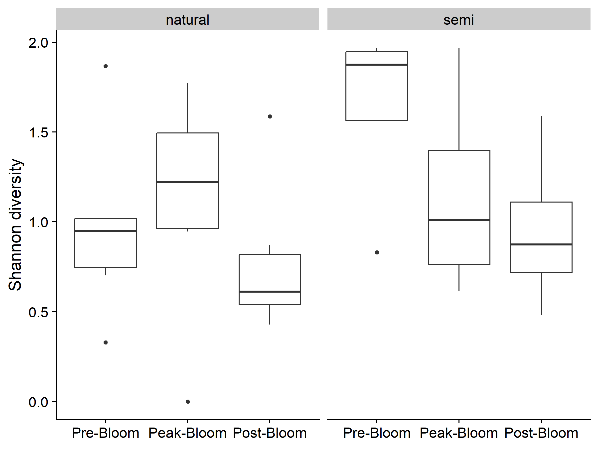
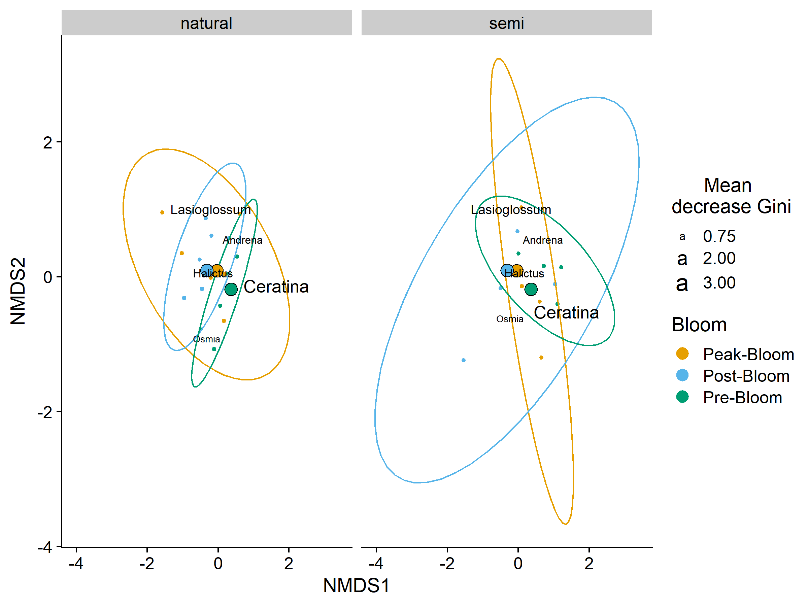

Canola Bee Analysis
================
Dr. Riley M. Anderson, Olivia Shaffer, & Salena Helmreich
February 18, 2025

  

- [Overview](#overview)
  - [Summary of Results](#summary-of-results)
- [Plant community composition](#plant-community-composition)
  - [Plant diversity across bloom
    period](#plant-diversity-across-bloom-period)
  - [Plant community diversity across bloom period and
    canola](#plant-community-diversity-across-bloom-period-and-canola)
  - [Turnover of floral resources](#turnover-of-floral-resources)
- [Bee diversity across bloom
  periods](#bee-diversity-across-bloom-periods)
- [Bee turnover across bloom
  periods](#bee-turnover-across-bloom-periods)
- [Testing Olivia’s predictions](#testing-olivias-predictions)
  - [Bee community composition](#bee-community-composition)
    - 
    - [Site classification by species composition (Random
      Forest)](#site-classification-by-species-composition-random-forest)
    - [Bee composition by habitat
      type](#bee-composition-by-habitat-type)
    - [Bee composition by habitat type and bloom
      period](#bee-composition-by-habitat-type-and-bloom-period)
  - [Session Information](#session-information)

## Overview

This analysis explores Salena and Olivia’s canola experiment.

### Summary of Results

- No difference in bee community composition across habitat types
  (natural or semi-natural), or habitat types and bloom period.

## Plant community composition

### Plant diversity across bloom period

<!-- -->

### Plant community diversity across bloom period and canola

<!-- -->

### Turnover of floral resources

 diversity

<!-- -->

<!-- -->

## Bee diversity across bloom periods

## Bee turnover across bloom periods

# Testing Olivia’s predictions

1)  The stability of bee communities (measured as turnover from the pre-
    to peak- to post-bloom) will be greater in landscapes with less
    access to pulse-blooming resources. **Evidence in support of this
    prediction will be a positive relationship between
    
    diversity and the proportion of canola surrounding each site or a
    negative relationship between
    
    diversity and the distance to the nearest canola.**

<!-- --><!-- --><!-- --><!-- -->

2)  Bee communities at sites with more canola in the landscape will have
    less stability due to a reliance on pulsed floral resources

**How is this different from the first prediction?**

3)  Bee communities will be more diverse during peak bloom than pre- and
    post-bloom
    <!-- -->

<!-- -->

    ## 
    ## Call:
    ## lm(formula = div ~ period, data = bee_div)
    ## 
    ## Residuals:
    ##      Min       1Q   Median       3Q      Max 
    ## -0.83433 -0.31602  0.07863  0.36834  0.88282 
    ## 
    ## Coefficients:
    ##                  Estimate Std. Error t value Pr(>|t|)    
    ## (Intercept)       1.28489    0.16024   8.019 1.29e-08 ***
    ## periodPeak-Bloom  0.12301    0.22661   0.543    0.592    
    ## periodPost-Bloom -0.01293    0.22661  -0.057    0.955    
    ## ---
    ## Signif. codes:  0 '***' 0.001 '**' 0.01 '*' 0.05 '.' 0.1 ' ' 1
    ## 
    ## Residual standard error: 0.5067 on 27 degrees of freedom
    ## Multiple R-squared:  0.01598,    Adjusted R-squared:  -0.05691 
    ## F-statistic: 0.2193 on 2 and 27 DF,  p-value: 0.8045

4)  Bee health metrics will be greater in landscapes with more canola

<!-- -->

    ## Linear mixed model fit by REML ['lmerMod']
    ## Formula: head_width ~ propCan500m + scale(DistanceToCanola) + (propCan500m |  
    ##     genus)
    ##    Data: bee_hw
    ## 
    ## REML criterion at convergence: 1304.2
    ## 
    ## Scaled residuals: 
    ##     Min      1Q  Median      3Q     Max 
    ## -3.6629 -0.4708 -0.0622  0.3798  8.9505 
    ## 
    ## Random effects:
    ##  Groups   Name        Variance Std.Dev. Corr 
    ##  genus    (Intercept) 0.7891   0.8883        
    ##           propCan500m 1.0483   1.0239   -0.48
    ##  Residual             0.1517   0.3895        
    ## Number of obs: 1238, groups:  genus, 25
    ## 
    ## Fixed effects:
    ##                         Estimate Std. Error t value
    ## (Intercept)              2.64920    0.18253   14.51
    ## propCan500m             -0.86958    0.33839   -2.57
    ## scale(DistanceToCanola) -0.04624    0.01562   -2.96
    ## 
    ## Correlation of Fixed Effects:
    ##             (Intr) prC500
    ## propCan500m -0.334       
    ## scl(DstnTC) -0.078  0.209

<!-- -->

5)  Bee health metrics will be positively related to stability of floral
    resources in the landscape

## Bee community composition

    ## Square root transformation
    ## Wisconsin double standardization
    ## Run 0 stress 0.1506233 
    ## Run 1 stress 0.1506236 
    ## ... Procrustes: rmse 0.0001942086  max resid 0.0004285341 
    ## ... Similar to previous best
    ## Run 2 stress 0.1551155 
    ## Run 3 stress 0.1506231 
    ## ... New best solution
    ## ... Procrustes: rmse 0.0004923118  max resid 0.001029397 
    ## ... Similar to previous best
    ## Run 4 stress 0.1506231 
    ## ... Procrustes: rmse 0.0001769166  max resid 0.0004186002 
    ## ... Similar to previous best
    ## Run 5 stress 0.1531276 
    ## Run 6 stress 0.1535258 
    ## Run 7 stress 0.1652858 
    ## Run 8 stress 0.1551145 
    ## Run 9 stress 0.1506233 
    ## ... Procrustes: rmse 0.0005241053  max resid 0.001100657 
    ## ... Similar to previous best
    ## Run 10 stress 0.1506231 
    ## ... New best solution
    ## ... Procrustes: rmse 5.267158e-05  max resid 0.0001202805 
    ## ... Similar to previous best
    ## Run 11 stress 0.1506233 
    ## ... Procrustes: rmse 0.0002227961  max resid 0.000457188 
    ## ... Similar to previous best
    ## Run 12 stress 0.153126 
    ## Run 13 stress 0.1506231 
    ## ... Procrustes: rmse 0.0003453836  max resid 0.000813457 
    ## ... Similar to previous best
    ## Run 14 stress 0.1601341 
    ## Run 15 stress 0.1506233 
    ## ... Procrustes: rmse 0.0001914441  max resid 0.0004053326 
    ## ... Similar to previous best
    ## Run 16 stress 0.1602459 
    ## Run 17 stress 0.1506235 
    ## ... Procrustes: rmse 0.0006440394  max resid 0.001423343 
    ## ... Similar to previous best
    ## Run 18 stress 0.160104 
    ## Run 19 stress 0.1531217 
    ## Run 20 stress 0.1506232 
    ## ... Procrustes: rmse 0.0005007227  max resid 0.001105443 
    ## ... Similar to previous best
    ## *** Best solution repeated 6 times
    ## 
    ## ***VECTORS
    ## 
    ##                          NMDS1    NMDS2    NMDS3     r2 Pr(>r)  
    ## log(DistanceToCanola) -0.19644  0.03528  0.97988 0.1715  0.170  
    ## propCan1km             0.64350 -0.49823 -0.58110 0.2460  0.053 .
    ## ---
    ## Signif. codes:  0 '***' 0.001 '**' 0.01 '*' 0.05 '.' 0.1 ' ' 1
    ## Permutation: free
    ## Number of permutations: 999
    ## 
    ## ***FACTORS:
    ## 
    ## Centroids:
    ##                    NMDS1   NMDS2   NMDS3
    ## periodPeak-Bloom -0.2994 -0.0914 -0.0277
    ## periodPost-Bloom  0.0053  0.1644  0.2780
    ## periodPre-Bloom   0.2940 -0.0730 -0.2502
    ## 
    ## Goodness of fit:
    ##            r2 Pr(>r)   
    ## period 0.1744  0.008 **
    ## ---
    ## Signif. codes:  0 '***' 0.001 '**' 0.01 '*' 0.05 '.' 0.1 ' ' 1
    ## Permutation: free
    ## Number of permutations: 999
    ## 
    ## Family: gaussian 
    ## Link function: identity 
    ## 
    ## Formula:
    ## log(DistanceToCanola) ~ s(NMDS1, NMDS2, NMDS3, k = 9) + period
    ## 
    ## Parametric coefficients:
    ##                  Estimate Std. Error t value Pr(>|t|)    
    ## (Intercept)        6.1671     0.5654  10.908 2.31e-09 ***
    ## periodPost-Bloom  -0.7830     0.8679  -0.902    0.379    
    ## periodPre-Bloom    0.6845     0.8845   0.774    0.449    
    ## ---
    ## Signif. codes:  0 '***' 0.001 '**' 0.01 '*' 0.05 '.' 0.1 ' ' 1
    ## 
    ## Approximate significance of smooth terms:
    ##                      edf Ref.df     F p-value   
    ## s(NMDS1,NMDS2,NMDS3)   9      9 3.645 0.00939 **
    ## ---
    ## Signif. codes:  0 '***' 0.001 '**' 0.01 '*' 0.05 '.' 0.1 ' ' 1
    ## 
    ## R-sq.(adj) =  0.429   Deviance explained = 64.6%
    ## GCV = 4.3379  Scale est. = 2.6028    n = 30
    ## 
    ## Family: gaussian 
    ## Link function: identity 
    ## 
    ## Formula:
    ## propCan1km ~ s(NMDS1, NMDS2, NMDS3, k = 2) + period
    ## 
    ## Parametric coefficients:
    ##                  Estimate Std. Error t value Pr(>|t|)  
    ## (Intercept)       0.13955    0.06279   2.222   0.0393 *
    ## periodPost-Bloom  0.06739    0.09639   0.699   0.4934  
    ## periodPre-Bloom  -0.09049    0.09824  -0.921   0.3692  
    ## ---
    ## Signif. codes:  0 '***' 0.001 '**' 0.01 '*' 0.05 '.' 0.1 ' ' 1
    ## 
    ## Approximate significance of smooth terms:
    ##                      edf Ref.df     F p-value  
    ## s(NMDS1,NMDS2,NMDS3)   9      9 2.027  0.0965 .
    ## ---
    ## Signif. codes:  0 '***' 0.001 '**' 0.01 '*' 0.05 '.' 0.1 ' ' 1
    ## 
    ## R-sq.(adj) =    0.2   Deviance explained = 50.3%
    ## GCV = 0.053507  Scale est. = 0.032104  n = 30
    ## Permutation test for adonis under reduced model
    ## Terms added sequentially (first to last)
    ## Permutation: free
    ## Number of permutations: 999
    ## 
    ## adonis2(formula = bee_mat_species ~ log(DistanceToCanola) + propCan1km + period, data = bee_mat)
    ##                       Df SumOfSqs      R2      F Pr(>F)   
    ## log(DistanceToCanola)  1   0.1881 0.02258 0.7390  0.707   
    ## propCan1km             1   0.7290 0.08751 2.8637  0.002 **
    ## period                 2   1.0489 0.12591 2.0601  0.007 **
    ## Residual              25   6.3642 0.76399                 
    ## Total                 29   8.3303 1.00000                 
    ## ---
    ## Signif. codes:  0 '***' 0.001 '**' 0.01 '*' 0.05 '.' 0.1 ' ' 1
    ## Permutation test for adonis under reduced model
    ## Terms added sequentially (first to last)
    ## Permutation: free
    ## Number of permutations: 999
    ## 
    ## adonis2(formula = bee_mat_species ~ splines::ns(log(DistanceToCanola), df = 3) + propCan1km + period, data = bee_mat)
    ##                                            Df SumOfSqs      R2      F Pr(>F)   
    ## splines::ns(log(DistanceToCanola), df = 3)  3   1.1608 0.13935 1.5420  0.038 * 
    ## propCan1km                                  1   0.3493 0.04193 1.3919  0.142   
    ## period                                      2   1.0489 0.12591 2.0900  0.003 **
    ## Residual                                   23   5.7713 0.69281                 
    ## Total                                      29   8.3303 1.00000                 
    ## ---
    ## Signif. codes:  0 '***' 0.001 '**' 0.01 '*' 0.05 '.' 0.1 ' ' 1
    ## Permutation test for adonis under reduced model
    ## Terms added sequentially (first to last)
    ## Permutation: free
    ## Number of permutations: 999
    ## 
    ## adonis2(formula = bee_mat_species ~ splines::ns(propCan1km, df = 3) + DistanceToCanola + period, data = bee_mat)
    ##                                 Df SumOfSqs      R2      F Pr(>F)   
    ## splines::ns(propCan1km, df = 3)  2   0.8194 0.09837 1.6126  0.050 * 
    ## DistanceToCanola                 1   0.3641 0.04370 1.4329  0.158   
    ## period                           2   1.0489 0.12591 2.0641  0.004 **
    ## Residual                        24   6.0979 0.73201                 
    ## Total                           29   8.3303 1.00000                 
    ## ---
    ## Signif. codes:  0 '***' 0.001 '**' 0.01 '*' 0.05 '.' 0.1 ' ' 1
    ## Permutation test for adonis under reduced model
    ## Terms added sequentially (first to last)
    ## Permutation: free
    ## Number of permutations: 999
    ## 
    ## adonis2(formula = bee_mat_species ~ splines::ns(propCan1km, df = 3) + splines::ns(DistanceToCanola, df = 3) + period, data = bee_mat)
    ##                                       Df SumOfSqs      R2      F Pr(>F)   
    ## splines::ns(propCan1km, df = 3)        2   0.8194 0.09837 1.6508  0.028 * 
    ## splines::ns(DistanceToCanola, df = 3)  3   1.0015 0.12023 1.3450  0.104   
    ## period                                 2   1.0489 0.12591 2.1130  0.008 **
    ## Residual                              22   5.4604 0.65549                 
    ## Total                                 29   8.3303 1.00000                 
    ## ---
    ## Signif. codes:  0 '***' 0.001 '**' 0.01 '*' 0.05 '.' 0.1 ' ' 1

    ## 
    ## Family: gaussian 
    ## Link function: identity 
    ## 
    ## Formula:
    ## propCan1km ~ s(NMDS1, NMDS2, bs = "ts")
    ## 
    ## Parametric coefficients:
    ##             Estimate Std. Error t value Pr(>|t|)    
    ## (Intercept)   0.1318     0.0342   3.856 0.000628 ***
    ## ---
    ## Signif. codes:  0 '***' 0.001 '**' 0.01 '*' 0.05 '.' 0.1 ' ' 1
    ## 
    ## Approximate significance of smooth terms:
    ##                  edf Ref.df     F p-value  
    ## s(NMDS1,NMDS2) 1.352     29 0.144  0.0616 .
    ## ---
    ## Signif. codes:  0 '***' 0.001 '**' 0.01 '*' 0.05 '.' 0.1 ' ' 1
    ## 
    ## R-sq.(adj) =  0.126   Deviance explained = 16.6%
    ## GCV = 0.038069  Scale est. = 0.035084  n = 30

<!-- -->

### 

    ## Permutation test for adonis under reduced model
    ## Terms added sequentially (first to last)
    ## Permutation: free
    ## Number of permutations: 999
    ## 
    ## adonis2(formula = habitat_matrix ~ land_type * period, data = habitat_meta, method = "bray")
    ##                  Df SumOfSqs      R2      F Pr(>F)
    ## land_type         1   0.2837 0.03403 0.9741  0.478
    ## period            2   0.5423 0.06505 0.9310  0.534
    ## land_type:period  2   0.5212 0.06251 0.8947  0.585
    ## Residual         24   6.9900 0.83842              
    ## Total            29   8.3372 1.00000
    ## 
    ## Permutation test for homogeneity of multivariate dispersions
    ## Permutation: free
    ## Number of permutations: 999
    ## 
    ## Response: Distances
    ##           Df  Sum Sq   Mean Sq      F N.Perm Pr(>F)
    ## Groups     1 0.00197 0.0019684 0.1395    999  0.727
    ## Residuals 28 0.39496 0.0141059
    ## Permutation test for adonis under reduced model
    ## Terms added sequentially (first to last)
    ## Permutation: free
    ## Number of permutations: 999
    ## 
    ## adonis2(formula = habitat_matrix ~ period, data = habitat_meta, method = "bray")
    ##          Df SumOfSqs      R2      F Pr(>F)
    ## period    2   0.5423 0.06505 0.9392  0.529
    ## Residual 27   7.7949 0.93495              
    ## Total    29   8.3372 1.00000
    ## 
    ## Permutation test for homogeneity of multivariate dispersions
    ## Permutation: free
    ## Number of permutations: 999
    ## 
    ## Response: Distances
    ##           Df   Sum Sq  Mean Sq      F N.Perm Pr(>F)
    ## Groups     2 0.026775 0.013388 1.2897    999  0.299
    ## Residuals 27 0.280276 0.010381
    ## Permutation test for adonis under reduced model
    ## Terms added sequentially (first to last)
    ## Permutation: free
    ## Number of permutations: 999
    ## 
    ## adonis2(formula = habitat_matrix ~ site, data = habitat_meta, method = "bray")
    ##          Df SumOfSqs      R2      F Pr(>F)
    ## site      9   2.7920 0.33488 1.1189  0.242
    ## Residual 20   5.5452 0.66512              
    ## Total    29   8.3372 1.00000
    ## 
    ## Permutation test for homogeneity of multivariate dispersions
    ## Permutation: free
    ## Number of permutations: 999
    ## 
    ## Response: Distances
    ##           Df  Sum Sq  Mean Sq      F N.Perm Pr(>F)
    ## Groups     9 0.16911 0.018791 0.6796    999  0.701
    ## Residuals 20 0.55301 0.027650

### Site classification by species composition (Random Forest)

    ## Random Forest 
    ## 
    ## 30 samples
    ## 27 predictors
    ##  2 classes: 'natural', 'semi' 
    ## 
    ## No pre-processing
    ## Resampling: Bootstrapped (25 reps) 
    ## Summary of sample sizes: 30, 30, 30, 30, 30, 30, ... 
    ## Resampling results across tuning parameters:
    ## 
    ##   mtry  Accuracy   Kappa    
    ##    2    0.7428952  0.4984826
    ##   14    0.9771429  0.9600000
    ##   27    0.9771429  0.9600000
    ## 
    ## Accuracy was used to select the optimal model using the largest value.
    ## The final value used for the model was mtry = 14.
    ## 
    ## Call:
    ##  randomForest(x = select(rf_matrix, -period, -site, -period_site_land),      y = rf_matrix$land_type, mtry = 2, importance = T, nPerm = 999,      proximity = T) 
    ##                Type of random forest: classification
    ##                      Number of trees: 500
    ## No. of variables tried at each split: 2
    ## 
    ##         OOB estimate of  error rate: 23.33%
    ## Confusion matrix:
    ##         natural semi class.error
    ## natural      17    1  0.05555556
    ## semi          6    6  0.50000000
    ##                 natural       semi MeanDecreaseAccuracy MeanDecreaseGini
    ## land_type    21.9224479 21.1064934           24.0121931      6.182612016
    ## Agapostemon  -1.0010015  1.3020693            0.7041178      0.040929881
    ## Andrena      -1.8734867 -1.3171152           -2.1846462      0.700327133
    ## Anthidium     1.0010015  1.0010015            1.4160757      0.076424879
    ## Anthophora    1.7346908  1.0010015            1.6013751      0.065005102
    ## Apis         -2.0194689 -2.6058064           -2.4972083      0.193285889
    ## Bombus       -1.5056962 -2.1111012           -2.3579551      0.321981590
    ## Ceratina      5.5273397  3.1290963            5.6267554      1.576521605
    ## Colletes     -2.6004050 -1.1066158           -2.2259947      0.062988719
    ## Diadasia      0.0000000  0.0000000            0.0000000      0.032191304
    ## Dufourea      1.9883796  0.0000000            1.9926647      0.062735702
    ## Epoleus       0.0000000  0.0000000            0.0000000      0.025431158
    ## Halictus     -0.6098231 -2.4390369           -2.0628896      0.749649307
    ## Heriades      0.0000000  0.0000000            0.0000000      0.006565423
    ## Hoplitis      0.0000000  0.0000000            0.0000000      0.035003071
    ## Hylaeus      -1.8094746 -1.7614476           -1.8680348      0.196791120
    ## Lasioglossum -1.6774286 -2.8397302           -2.5864748      0.927957115
    ## Megachile     1.7457552  1.1361148            2.1135119      0.272919749
    ## Melissodes    0.9180676 -0.2831824            0.4454042      0.213937201
    ## Nomada       -1.8830734 -3.1078544           -3.8089643      0.510707732
    ## Nomia         0.0000000  0.0000000            0.0000000      0.015850899
    ## Osmia         1.6757713  0.3486643            1.4647412      0.593804974
    ## Panurginus    0.0000000 -1.0010015           -1.0010015      0.045545937
    ## Peponapis     0.0000000  0.0000000            0.0000000      0.148566218
    ## Perdita       0.6340438  1.9058067            1.8977683      0.120270107
    ## Protandrena  -0.6547178  1.0010015           -0.1002678      0.070488165
    ## Sphecodes     1.3652526 -0.9806404            0.1964027      0.403610469

|              | natural |   semi | MeanDecreaseAccuracy | MeanDecreaseGini |
|:-------------|--------:|-------:|---------------------:|-----------------:|
| land_type    |  21.922 | 21.106 |               24.012 |            6.183 |
| Ceratina     |   5.527 |  3.129 |                5.627 |            1.577 |
| Lasioglossum |  -1.677 | -2.840 |               -2.586 |            0.928 |
| Halictus     |  -0.610 | -2.439 |               -2.063 |            0.750 |
| Andrena      |  -1.873 | -1.317 |               -2.185 |            0.700 |
| Osmia        |   1.676 |  0.349 |                1.465 |            0.594 |

    ## 
    ## Call:
    ##  randomForest(x = select(rf_matrix, -period, -site, -period_site_land),      y = rf_matrix$land_type, importance = T, nPerm = 999, proximity = T) 
    ##                Type of random forest: classification
    ##                      Number of trees: 500
    ## No. of variables tried at each split: 5
    ## 
    ##         OOB estimate of  error rate: 3.33%
    ## Confusion matrix:
    ##         natural semi class.error
    ## natural      17    1  0.05555556
    ## semi          0   12  0.00000000

<!-- -->

**Random Forest classification of habitat type by species composition.**
The model was tuned without pre-processing. Overall model accuracy was
81%. The model can delineate the habitat types with an overall *out of
bag error* of 3.33% using bee community composition as the predictor
matrix.

### Bee composition by habitat type

<!-- -->
**Variation in community composition across habitat types.** Bee species
are plotted on a two-dimensional non-metric multidimensional scaling
ordination of the 30 combinations of site, period, and habitat type.
Small points are the individual site/period/habitat combinations. Large
points are the centroids of the two habitat types with natural habitat
in orange, semi-natural habitat in blue. Ellipses are 95% confidence
intervals around the habitat centroids. Bees species shown are the most
representative (top 20th percentile of a random forest analysis) of the
compositional differences among sites. Text size of the labels is
proportional to variable importance score (mean decrease in Gini score).

### Bee composition by habitat type and bloom period

<!-- -->

Note that there is considerable overlap in community composition at all
comparisons (PERMANOVA **habitat;** *P* = 0.44, *F* = 0.99, **site;**
*P* = 0.27, *F* = 1.12, **period**; *P* = 0.54, *F* = 0.94). From this
analysis, we can conclude that community bee community composition does
not vary across natural/semi-natural habitat types, sites, or bloom
period.

## Session Information

    R version 4.2.3 (2023-03-15 ucrt)
    Platform: x86_64-w64-mingw32/x64 (64-bit)
    Running under: Windows 10 x64 (build 19045)

    Matrix products: default

    locale:
    [1] LC_COLLATE=English_United States.utf8 
    [2] LC_CTYPE=English_United States.utf8   
    [3] LC_MONETARY=English_United States.utf8
    [4] LC_NUMERIC=C                          
    [5] LC_TIME=English_United States.utf8    

    attached base packages:
    [1] stats     graphics  grDevices utils     datasets  methods   base     

    other attached packages:
     [1] caret_6.0-94         randomForest_4.7-1.1 vegan_2.6-6.1       
     [4] lattice_0.20-45      permute_0.9-7        emmeans_1.10.2      
     [7] knitr_1.47           car_3.1-2            carData_3.0-5       
    [10] sjPlot_2.8.16        lme4_1.1-35.3        Matrix_1.5-3        
    [13] glmmTMB_1.1.9        cowplot_1.1.3        lubridate_1.9.3     
    [16] forcats_1.0.0        stringr_1.5.1        dplyr_1.1.4         
    [19] purrr_1.0.2          readr_2.1.5          tidyr_1.3.1         
    [22] tibble_3.2.1         ggplot2_3.5.1        tidyverse_2.0.0     

    loaded via a namespace (and not attached):
     [1] TH.data_1.1-2        minqa_1.2.7          colorspace_2.1-0    
     [4] class_7.3-21         sjlabelled_1.2.0     rprojroot_2.0.4     
     [7] estimability_1.5.1   proxy_0.4-27         rstudioapi_0.16.0   
    [10] farver_2.1.2         listenv_0.9.1        ggrepel_0.9.5       
    [13] prodlim_2023.08.28   fansi_1.0.6          mvtnorm_1.2-5       
    [16] codetools_0.2-19     splines_4.2.3        sjmisc_2.8.10       
    [19] nloptr_2.0.3         pROC_1.18.5          ggeffects_1.6.0     
    [22] cluster_2.1.4        compiler_4.2.3       sjstats_0.19.0      
    [25] fastmap_1.2.0        cli_3.6.2            htmltools_0.5.8.1   
    [28] tools_4.2.3          coda_0.19-4.1        gtable_0.3.5        
    [31] glue_1.7.0           reshape2_1.4.4       Rcpp_1.0.12         
    [34] vctrs_0.6.5          nlme_3.1-162         iterators_1.0.14    
    [37] insight_0.20.1       timeDate_4032.109    gower_1.0.1         
    [40] xfun_0.44            globals_0.16.3       timechange_0.3.0    
    [43] lifecycle_1.0.4      future_1.33.2        MASS_7.3-58.2       
    [46] zoo_1.8-12           scales_1.3.0         ipred_0.9-14        
    [49] hms_1.1.3            parallel_4.2.3       sandwich_3.1-0      
    [52] TMB_1.9.11           yaml_2.3.8           rpart_4.1.23        
    [55] stringi_1.8.4        highr_0.11           foreach_1.5.2       
    [58] e1071_1.7-14         hardhat_1.4.0        boot_1.3-28.1       
    [61] lava_1.8.0           rlang_1.1.4          pkgconfig_2.0.3     
    [64] evaluate_0.24.0      labeling_0.4.3       recipes_1.0.10      
    [67] tidyselect_1.2.1     parallelly_1.37.1    plyr_1.8.9          
    [70] magrittr_2.0.3       R6_2.5.1             generics_0.1.3      
    [73] multcomp_1.4-25      pillar_1.9.0         withr_3.0.0         
    [76] mgcv_1.8-42          survival_3.5-3       datawizard_0.11.0   
    [79] abind_1.4-5          nnet_7.3-18          future.apply_1.11.2 
    [82] performance_0.12.0   utf8_1.2.4           tzdb_0.4.0          
    [85] rmarkdown_2.27       grid_4.2.3           data.table_1.15.4   
    [88] ModelMetrics_1.2.2.2 digest_0.6.35        xtable_1.8-4        
    [91] numDeriv_2016.8-1.1  stats4_4.2.3         munsell_0.5.1       
