Canola Bee Analysis
================
Dr. Riley M. Anderson, Olivia Shaffer, & Salena Helmreich
December 10, 2025

  

- [Overview](#overview)
  - [Summary of Results](#summary-of-results)
- [Summary stats for head width
  model](#summary-stats-for-head-width-model)
- [Mixed-model figure](#mixed-model-figure)
- [Random slopes figure](#random-slopes-figure)
- [Bee diversity (PERMANOVA)](#bee-diversity-permanova)
- [CAP (bee composition by canola)](#cap-bee-composition-by-canola)
  - [In canola or not](#in-canola-or-not)
  - [Proportion canola](#proportion-canola)
  - [Plant richness](#plant-richness)
  - [Session Information](#session-information)

## Overview

This analysis explores Salena and Olivia’s canola experiment.

### Summary of Results

- No difference in bee community composition across habitat types
  (natural or semi-natural), or habitat types and bloom period.

<!-- -->

    ##    min  max
    ## 1 0.96 5.38

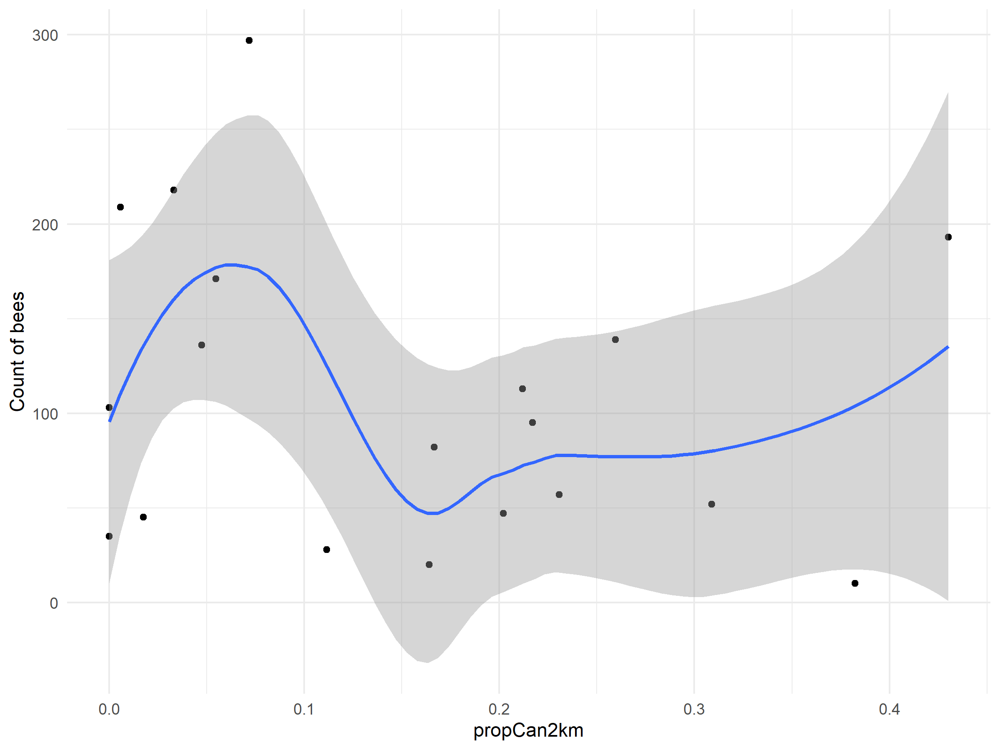<!-- -->

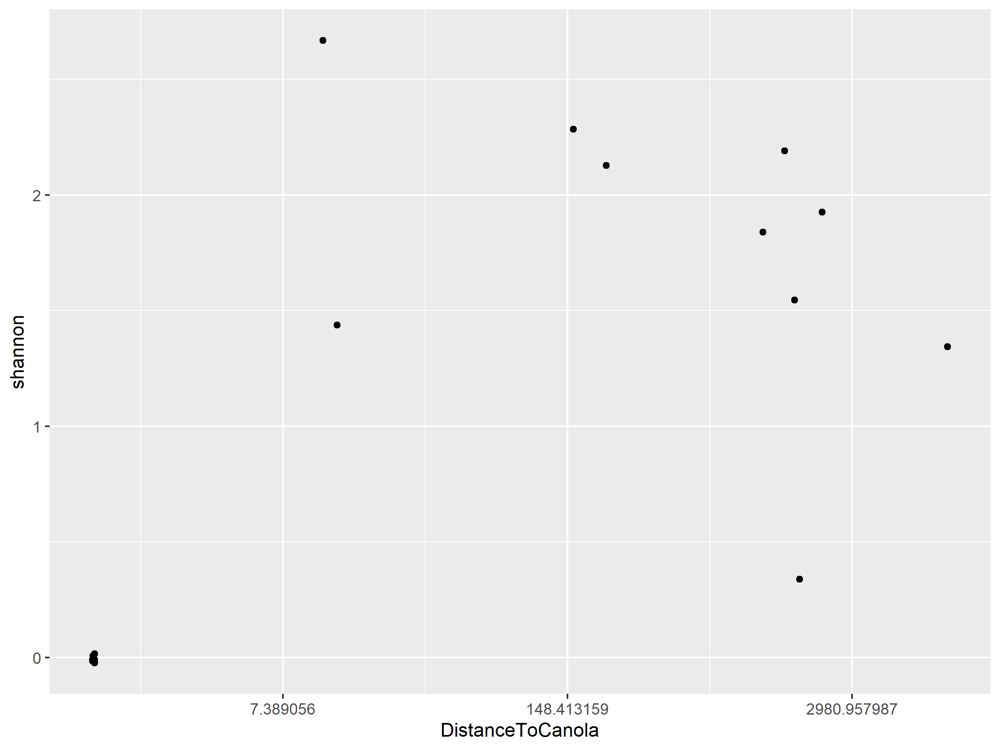<!-- -->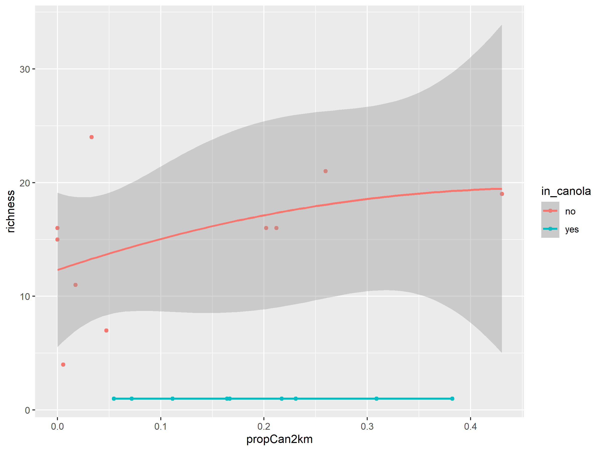<!-- -->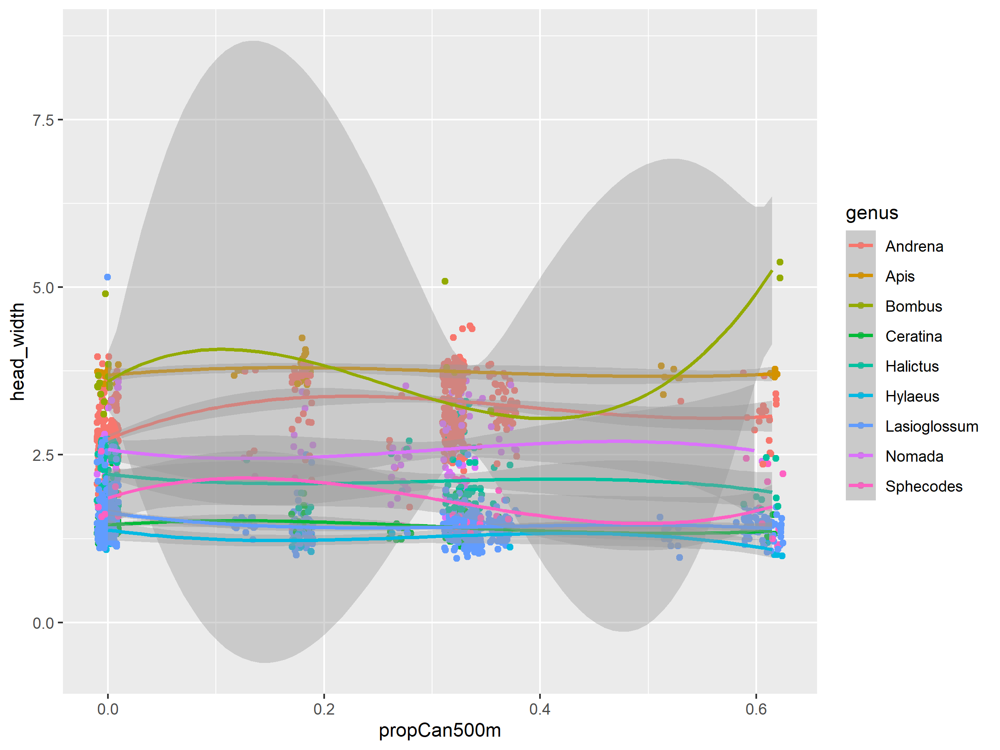<!-- -->

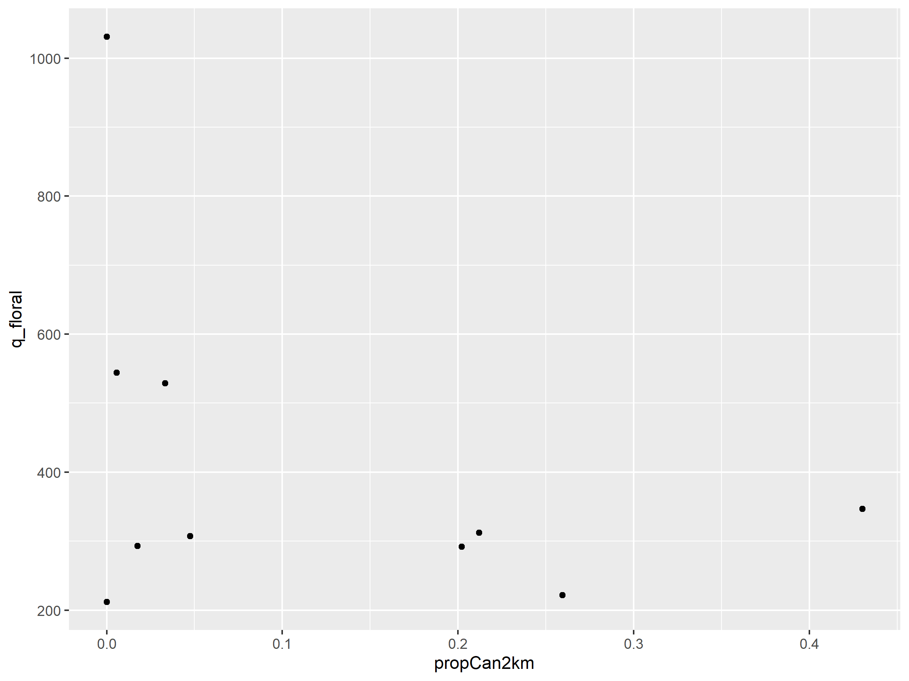<!-- -->

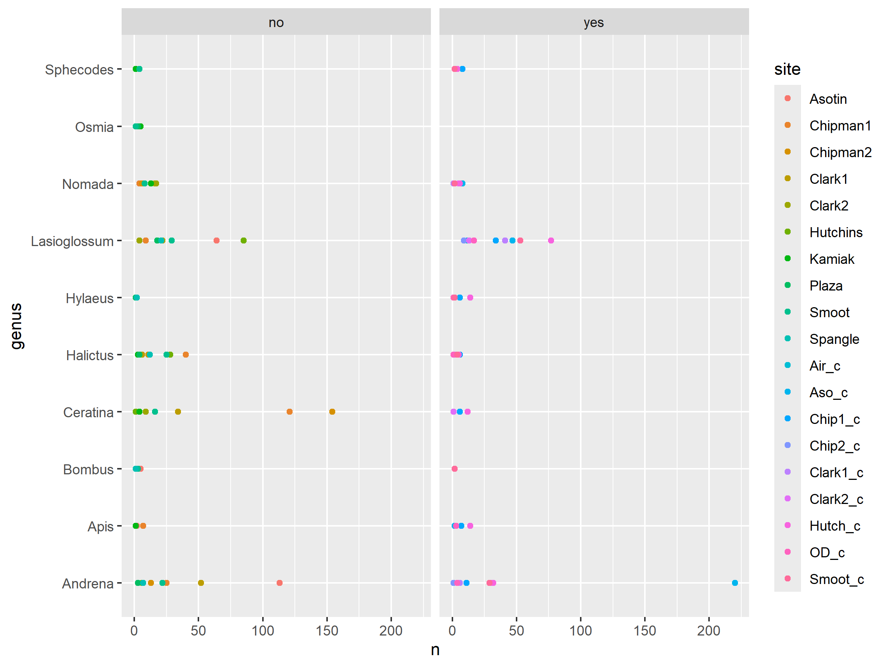<!-- -->

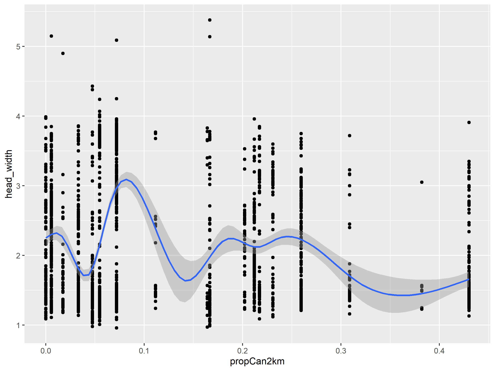<!-- -->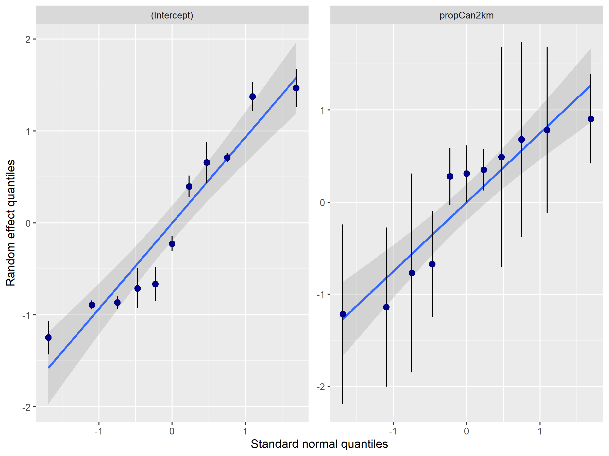<!-- -->

    ## Linear mixed model fit by REML ['lmerMod']
    ## Formula: head_width ~ in_canola * propCan2km + (propCan2km | genus)
    ##    Data: semi_join(bee_head_width, ten_bees, by = "genus")
    ## 
    ## REML criterion at convergence: 2083.9
    ## 
    ## Scaled residuals: 
    ##     Min      1Q  Median      3Q     Max 
    ## -4.9362 -0.5333 -0.0888  0.5370  9.3249 
    ## 
    ## Random effects:
    ##  Groups   Name        Variance Std.Dev. Corr 
    ##  genus    (Intercept) 0.9295   0.9641        
    ##           propCan2km  0.7997   0.8942   -0.74
    ##  Residual             0.1615   0.4019        
    ## Number of obs: 1969, groups:  genus, 11
    ## 
    ## Fixed effects:
    ##                         Estimate Std. Error t value
    ## (Intercept)              2.29361    0.29191   7.857
    ## in_canolayes             0.30047    0.03331   9.019
    ## propCan2km              -0.35435    0.31671  -1.119
    ## in_canolayes:propCan2km -0.84820    0.22630  -3.748
    ## 
    ## Correlation of Fixed Effects:
    ##             (Intr) in_cnl prpCn2
    ## in_canolays -0.027              
    ## propCan2km  -0.652  0.101       
    ## in_cnlys:C2  0.015 -0.764 -0.159

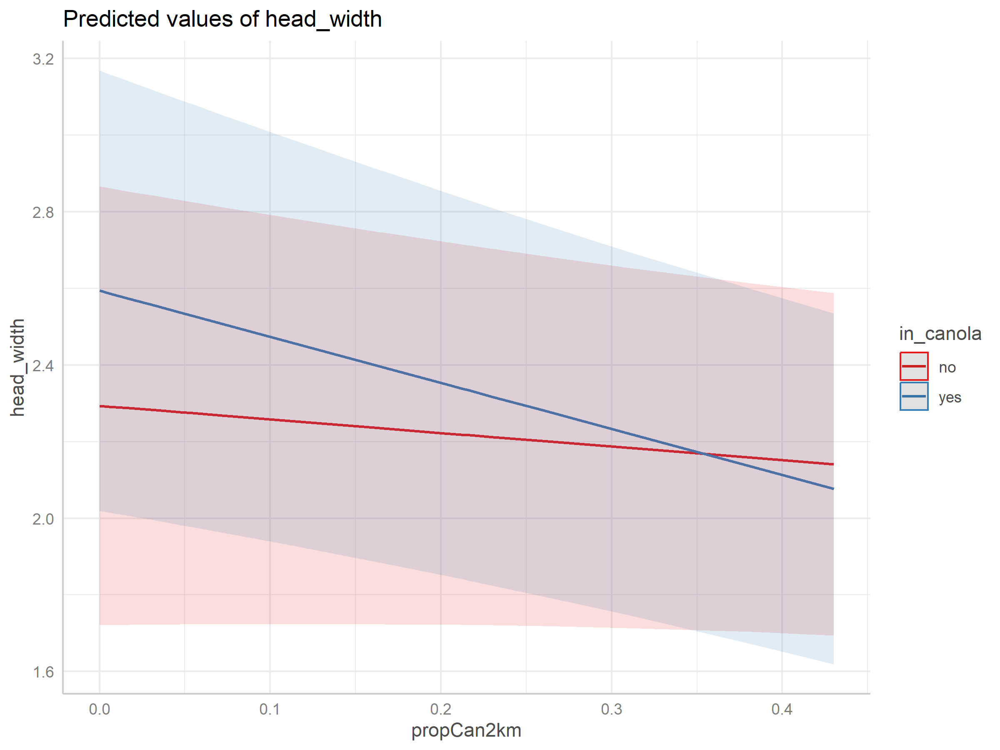<!-- -->

## Summary stats for head width model

|   X | Parameter                  | Coefficient |   SE |   CI | CI_low | CI_high |     t | df_error |    p | Effects | Group    |
|----:|:---------------------------|------------:|-----:|-----:|-------:|--------:|------:|---------:|-----:|:--------|:---------|
|   1 | (Intercept)                |        2.29 | 0.29 | 0.95 |   1.72 |    2.87 |  7.86 |     1961 | 0.00 | fixed   |          |
|   2 | in_canolayes               |        0.30 | 0.03 | 0.95 |   0.24 |    0.37 |  9.02 |     1961 | 0.00 | fixed   |          |
|   3 | propCan2km                 |       -0.35 | 0.32 | 0.95 |  -0.98 |    0.27 | -1.12 |     1961 | 0.26 | fixed   |          |
|   4 | in_canolayes:propCan2km    |       -0.85 | 0.23 | 0.95 |  -1.29 |   -0.40 | -3.75 |     1961 | 0.00 | fixed   |          |
|   5 | SD (Intercept)             |        0.96 |   NA | 0.95 |     NA |      NA |    NA |       NA |   NA | random  | genus    |
|   6 | SD (propCan2km)            |        0.89 |   NA | 0.95 |     NA |      NA |    NA |       NA |   NA | random  | genus    |
|   7 | Cor (Intercept~propCan2km) |       -0.74 |   NA | 0.95 |     NA |      NA |    NA |       NA |   NA | random  | genus    |
|   8 | SD (Observations)          |        0.40 |   NA | 0.95 |     NA |      NA |    NA |       NA |   NA | random  | Residual |

<table style="border-collapse:collapse; border:none;">
<tr>
<th style="border-top: double; text-align:center; font-style:normal; font-weight:bold; padding:0.2cm;  text-align:left; ">
 
</th>
<th colspan="6" style="border-top: double; text-align:center; font-style:normal; font-weight:bold; padding:0.2cm; ">
head_width
</th>
</tr>
<tr>
<td style=" text-align:center; border-bottom:1px solid; font-style:italic; font-weight:normal;  text-align:left; ">
Predictors
</td>
<td style=" text-align:center; border-bottom:1px solid; font-style:italic; font-weight:normal;  ">
Estimates
</td>
<td style=" text-align:center; border-bottom:1px solid; font-style:italic; font-weight:normal;  ">
std. Beta
</td>
<td style=" text-align:center; border-bottom:1px solid; font-style:italic; font-weight:normal;  ">
CI
</td>
<td style=" text-align:center; border-bottom:1px solid; font-style:italic; font-weight:normal;  ">
standardized CI
</td>
<td style=" text-align:center; border-bottom:1px solid; font-style:italic; font-weight:normal;  ">
p
</td>
<td style=" text-align:center; border-bottom:1px solid; font-style:italic; font-weight:normal;  col7">
std. p
</td>
</tr>
<tr>
<td style=" padding:0.2cm; text-align:left; vertical-align:top; text-align:left; ">
(Intercept)
</td>
<td style=" padding:0.2cm; text-align:left; vertical-align:top; text-align:center;  ">
2.294
</td>
<td style=" padding:0.2cm; text-align:left; vertical-align:top; text-align:center;  ">
0.080
</td>
<td style=" padding:0.2cm; text-align:left; vertical-align:top; text-align:center;  ">
-Inf – Inf
</td>
<td style=" padding:0.2cm; text-align:left; vertical-align:top; text-align:center;  ">
-Inf – Inf
</td>
<td style=" padding:0.2cm; text-align:left; vertical-align:top; text-align:center;  ">
<strong>\<0.001</strong>
</td>
<td style=" padding:0.2cm; text-align:left; vertical-align:top; text-align:center;  col7">
0.789
</td>
</tr>
<tr>
<td style=" padding:0.2cm; text-align:left; vertical-align:top; text-align:left; ">
in canola \[yes\]
</td>
<td style=" padding:0.2cm; text-align:left; vertical-align:top; text-align:center;  ">
0.300
</td>
<td style=" padding:0.2cm; text-align:left; vertical-align:top; text-align:center;  ">
0.209
</td>
<td style=" padding:0.2cm; text-align:left; vertical-align:top; text-align:center;  ">
-Inf – Inf
</td>
<td style=" padding:0.2cm; text-align:left; vertical-align:top; text-align:center;  ">
-Inf – Inf
</td>
<td style=" padding:0.2cm; text-align:left; vertical-align:top; text-align:center;  ">
<strong>\<0.001</strong>
</td>
<td style=" padding:0.2cm; text-align:left; vertical-align:top; text-align:center;  col7">
<strong>\<0.001</strong>
</td>
</tr>
<tr>
<td style=" padding:0.2cm; text-align:left; vertical-align:top; text-align:left; ">
propCan2km
</td>
<td style=" padding:0.2cm; text-align:left; vertical-align:top; text-align:center;  ">
-0.354
</td>
<td style=" padding:0.2cm; text-align:left; vertical-align:top; text-align:center;  ">
-0.053
</td>
<td style=" padding:0.2cm; text-align:left; vertical-align:top; text-align:center;  ">
-Inf – Inf
</td>
<td style=" padding:0.2cm; text-align:left; vertical-align:top; text-align:center;  ">
-Inf – Inf
</td>
<td style=" padding:0.2cm; text-align:left; vertical-align:top; text-align:center;  ">
0.263
</td>
<td style=" padding:0.2cm; text-align:left; vertical-align:top; text-align:center;  col7">
0.263
</td>
</tr>
<tr>
<td style=" padding:0.2cm; text-align:left; vertical-align:top; text-align:left; ">
in canola \[yes\] × propCan2km
</td>
<td style=" padding:0.2cm; text-align:left; vertical-align:top; text-align:center;  ">
-0.848
</td>
<td style=" padding:0.2cm; text-align:left; vertical-align:top; text-align:center;  ">
-0.127
</td>
<td style=" padding:0.2cm; text-align:left; vertical-align:top; text-align:center;  ">
-Inf – Inf
</td>
<td style=" padding:0.2cm; text-align:left; vertical-align:top; text-align:center;  ">
-Inf – Inf
</td>
<td style=" padding:0.2cm; text-align:left; vertical-align:top; text-align:center;  ">
<strong>\<0.001</strong>
</td>
<td style=" padding:0.2cm; text-align:left; vertical-align:top; text-align:center;  col7">
<strong>\<0.001</strong>
</td>
</tr>
<tr>
<td colspan="7" style="font-weight:bold; text-align:left; padding-top:.8em;">
Random Effects
</td>
</tr>
<tr>
<td style=" padding:0.2cm; text-align:left; vertical-align:top; text-align:left; padding-top:0.1cm; padding-bottom:0.1cm;">
σ2
</td>
<td style=" padding:0.2cm; text-align:left; vertical-align:top; padding-top:0.1cm; padding-bottom:0.1cm; text-align:left;" colspan="6">
0.16
</td>
</tr>
<tr>
<td style=" padding:0.2cm; text-align:left; vertical-align:top; text-align:left; padding-top:0.1cm; padding-bottom:0.1cm;">
τ00 genus
</td>
<td style=" padding:0.2cm; text-align:left; vertical-align:top; padding-top:0.1cm; padding-bottom:0.1cm; text-align:left;" colspan="6">
0.93
</td>
<tr>
<td style=" padding:0.2cm; text-align:left; vertical-align:top; text-align:left; padding-top:0.1cm; padding-bottom:0.1cm;">
τ11 genus.propCan2km
</td>
<td style=" padding:0.2cm; text-align:left; vertical-align:top; padding-top:0.1cm; padding-bottom:0.1cm; text-align:left;" colspan="6">
0.80
</td>
<tr>
<td style=" padding:0.2cm; text-align:left; vertical-align:top; text-align:left; padding-top:0.1cm; padding-bottom:0.1cm;">
ρ01 genus
</td>
<td style=" padding:0.2cm; text-align:left; vertical-align:top; padding-top:0.1cm; padding-bottom:0.1cm; text-align:left;" colspan="6">
-0.74
</td>
<tr>
<td style=" padding:0.2cm; text-align:left; vertical-align:top; text-align:left; padding-top:0.1cm; padding-bottom:0.1cm;">
ICC
</td>
<td style=" padding:0.2cm; text-align:left; vertical-align:top; padding-top:0.1cm; padding-bottom:0.1cm; text-align:left;" colspan="6">
0.83
</td>
<tr>
<td style=" padding:0.2cm; text-align:left; vertical-align:top; text-align:left; padding-top:0.1cm; padding-bottom:0.1cm;">
N genus
</td>
<td style=" padding:0.2cm; text-align:left; vertical-align:top; padding-top:0.1cm; padding-bottom:0.1cm; text-align:left;" colspan="6">
11
</td>
<tr>
<td style=" padding:0.2cm; text-align:left; vertical-align:top; text-align:left; padding-top:0.1cm; padding-bottom:0.1cm; border-top:1px solid;">
Observations
</td>
<td style=" padding:0.2cm; text-align:left; vertical-align:top; padding-top:0.1cm; padding-bottom:0.1cm; text-align:left; border-top:1px solid;" colspan="6">
1969
</td>
</tr>
<tr>
<td style=" padding:0.2cm; text-align:left; vertical-align:top; text-align:left; padding-top:0.1cm; padding-bottom:0.1cm;">
Marginal R2 / Conditional R2
</td>
<td style=" padding:0.2cm; text-align:left; vertical-align:top; padding-top:0.1cm; padding-bottom:0.1cm; text-align:left;" colspan="6">
0.016 / 0.832
</td>
</tr>
</table>

## Mixed-model figure

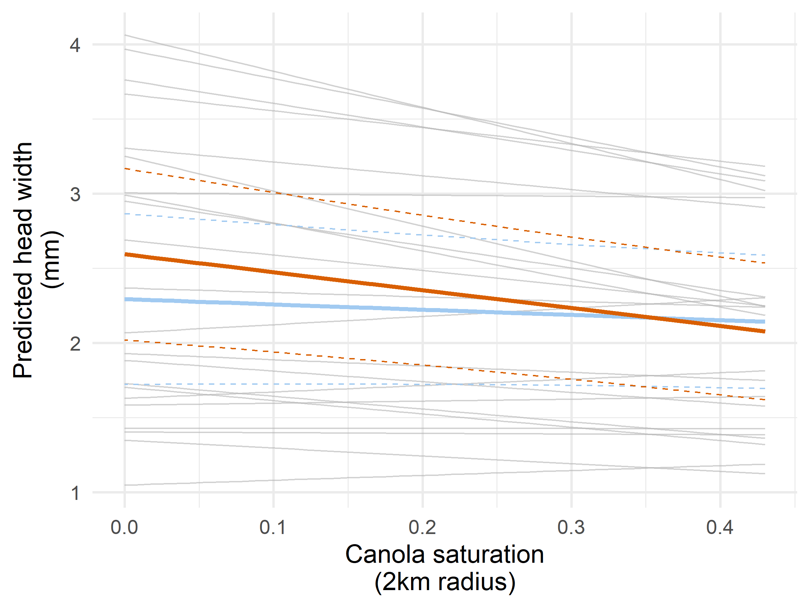<!-- -->

## Random slopes figure

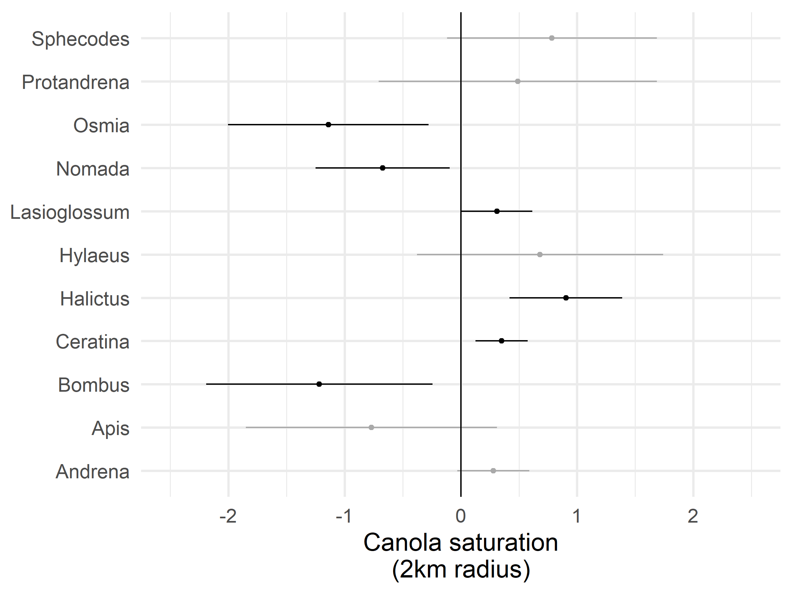<!-- -->

## Bee diversity (PERMANOVA)

|                                 |  Df | SumOfSqs |   R2 |    F | Pr(\>F) |
|:--------------------------------|----:|---------:|-----:|-----:|--------:|
| in_canola                       |   1 |     1.34 | 0.10 | 5.30 |    0.00 |
| JD                              |   1 |     0.14 | 0.01 | 0.55 |    0.89 |
| splines::ns(propCan2km, df = 5) |   5 |     1.75 | 0.13 | 1.38 |    0.05 |
| richness                        |   1 |     0.46 | 0.03 | 1.80 |    0.06 |
| shannon                         |   1 |     0.19 | 0.01 | 0.74 |    0.72 |
| Residual                        |  38 |     9.62 | 0.71 |   NA |      NA |
| Total                           |  47 |    13.50 | 1.00 |   NA |      NA |

    ## 
    ## Permutation test for homogeneity of multivariate dispersions
    ## Permutation: free
    ## Number of permutations: 999
    ## 
    ## Response: Distances
    ##           Df  Sum Sq   Mean Sq      F N.Perm Pr(>F)
    ## Groups     1 0.00052 0.0005236 0.0264    999  0.869
    ## Residuals 46 0.91378 0.0198648
    ## 
    ## Contrast: no_yes 
    ## 
    ##               average       sd    ratio      ava      avb cumsum     p  
    ## Lasioglossum  0.19911  0.17297  1.15110 11.17200 13.31600  0.258 0.280  
    ## Andrena       0.19390  0.18632  1.04070 12.62100 12.52600  0.510 0.011 *
    ## Ceratina      0.12220  0.19074  0.64070 12.58600  0.10500  0.669 0.306  
    ## Halictus      0.06341  0.09056  0.70010  4.34500  1.73700  0.751 0.557  
    ## Nomada        0.05046  0.06391  0.78950  3.24100  0.42100  0.817 0.022 *
    ## Apis          0.02430  0.04981  0.48790  0.93100  0.84200  0.848 0.463  
    ## Sphecodes     0.01871  0.02497  0.74910  0.96600  0.94700  0.873 0.286  
    ## Hylaeus       0.01718  0.03257  0.52740  0.79300  0.42100  0.895 0.582  
    ## Osmia         0.01512  0.03472  0.43540  0.65500  0.05300  0.914 0.178  
    ## Bombus        0.01339  0.02358  0.56770  0.20700  0.78900  0.932 0.132  
    ## Protandrena   0.00717  0.03836  0.18690  0.44800  0.00000  0.941 0.404  
    ## Megachile     0.00652  0.01817  0.35910  0.20700  0.15800  0.950 0.543  
    ## Perdita       0.00591  0.02142  0.27600  0.03400  0.21100  0.957 0.187  
    ## Dufourea      0.00518  0.02067  0.25070  0.24100  0.00000  0.964 0.465  
    ## Eucera        0.00419  0.01373  0.30530  0.27600  0.00000  0.969 0.443  
    ## Panurginus    0.00341  0.00995  0.34270  0.17200  0.05300  0.974 0.637  
    ## Colletes      0.00305  0.00870  0.35050  0.17200  0.05300  0.978 0.381  
    ## Melissodes    0.00303  0.01214  0.24990  0.13800  0.00000  0.982 0.410  
    ## Nomia         0.00293  0.01590  0.18410  0.00000  0.10500  0.986 0.398  
    ## Epoleus       0.00215  0.01057  0.20370  0.00000  0.10500  0.988 0.401  
    ## Agapostemon   0.00201  0.00638  0.31480  0.13800  0.00000  0.991 0.411  
    ## Heriades      0.00183  0.00748  0.24420  0.06900  0.05300  0.993 0.486  
    ## Anthidium     0.00152  0.00567  0.26820  0.03400  0.05300  0.995 0.420  
    ## Anthophora    0.00140  0.00547  0.25650  0.06900  0.00000  0.997 0.623  
    ## Diadasia      0.00086  0.00466  0.18500  0.10300  0.00000  0.998 0.419  
    ## Melecta       0.00058  0.00320  0.18050  0.03400  0.00000  0.999 0.403  
    ## Hoplitis      0.00029  0.00155  0.18500  0.03400  0.00000  0.999 0.419  
    ## Herides       0.00025  0.00137  0.18550  0.03400  0.00000  1.000 0.404  
    ## Sambuci       0.00025  0.00137  0.18550  0.03400  0.00000  1.000 0.404  
    ## ---
    ## Signif. codes:  0 '***' 0.001 '**' 0.01 '*' 0.05 '.' 0.1 ' ' 1
    ## Permutation: free
    ## Number of permutations: 999

# CAP (bee composition by canola)

## In canola or not

    ## 
    ## Call:
    ## capscale(formula = bee_matrix ~ in_canola, data = bee_meta, distance = "bray") 
    ## 
    ## Partitioning of squared Bray distance:
    ##               Inertia Proportion
    ## Total          14.753    1.00000
    ## Constrained     1.353    0.09173
    ## Unconstrained  13.400    0.90827
    ## 
    ## Eigenvalues, and their contribution to the squared Bray distance 
    ## 
    ## Importance of components:
    ##                          CAP1   MDS1   MDS2    MDS3    MDS4   MDS5    MDS6
    ## Eigenvalue            1.35334 2.5360 1.8801 1.26858 1.03099 0.8719 0.80779
    ## Proportion Explained  0.09173 0.1719 0.1274 0.08599 0.06988 0.0591 0.05475
    ## Cumulative Proportion 0.09173 0.2636 0.3911 0.47705 0.54694 0.6060 0.66079
    ##                          MDS7    MDS8    MDS9   MDS10   MDS11   MDS12   MDS13
    ## Eigenvalue            0.74258 0.65818 0.61798 0.46189 0.42211 0.32198 0.27030
    ## Proportion Explained  0.05033 0.04461 0.04189 0.03131 0.02861 0.02182 0.01832
    ## Cumulative Proportion 0.71112 0.75574 0.79762 0.82893 0.85754 0.87937 0.89769
    ##                         MDS14   MDS15   MDS16   MDS17    MDS18    MDS19
    ## Eigenvalue            0.25538 0.22179 0.20240 0.17211 0.137042 0.120110
    ## Proportion Explained  0.01731 0.01503 0.01372 0.01167 0.009289 0.008141
    ## Cumulative Proportion 0.91500 0.93003 0.94375 0.95542 0.964709 0.972850
    ##                          MDS20    MDS21    MDS22    MDS23    MDS24    MDS25
    ## Eigenvalue            0.105390 0.094658 0.068395 0.060763 0.028598 0.022168
    ## Proportion Explained  0.007144 0.006416 0.004636 0.004119 0.001938 0.001503
    ## Cumulative Proportion 0.979994 0.986410 0.991046 0.995164 0.997103 0.998605
    ##                           MDS26     MDS27     MDS28
    ## Eigenvalue            0.0120326 0.0075318 1.009e-03
    ## Proportion Explained  0.0008156 0.0005105 6.841e-05
    ## Cumulative Proportion 0.9994211 0.9999316 1.000e+00
    ## 
    ## Accumulated constrained eigenvalues
    ## Importance of components:
    ##                        CAP1
    ## Eigenvalue            1.353
    ## Proportion Explained  1.000
    ## Cumulative Proportion 1.000

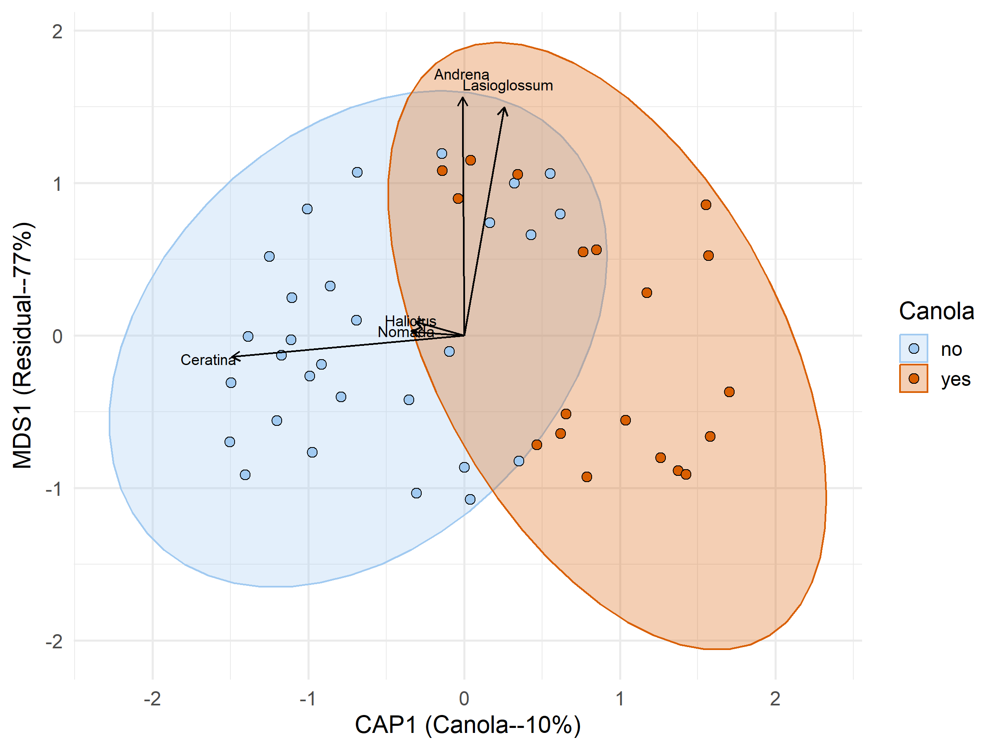<!-- -->

## Proportion canola

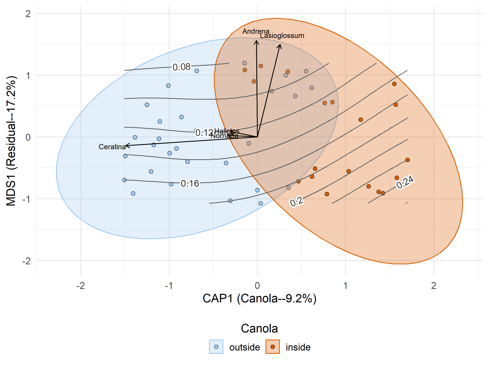<!-- -->

## Plant richness

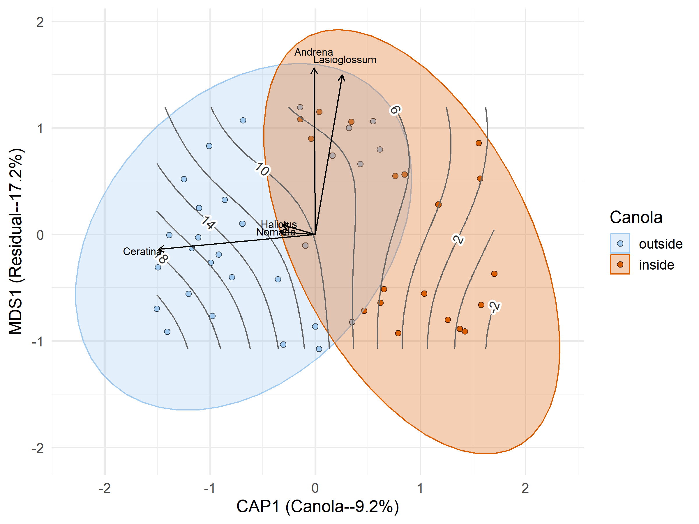<!-- -->

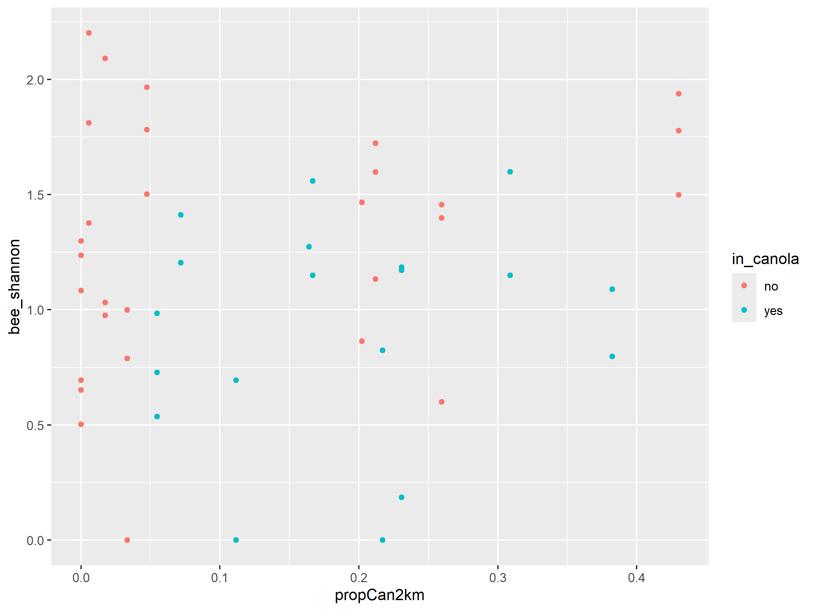<!-- -->

## Session Information

    R version 4.2.3 (2023-03-15 ucrt)
    Platform: x86_64-w64-mingw32/x64 (64-bit)
    Running under: Windows 10 x64 (build 26100)

    Matrix products: default

    locale:
    [1] LC_COLLATE=English_United States.utf8 
    [2] LC_CTYPE=English_United States.utf8   
    [3] LC_MONETARY=English_United States.utf8
    [4] LC_NUMERIC=C                          
    [5] LC_TIME=English_United States.utf8    

    attached base packages:
    [1] stats     graphics  grDevices utils     datasets  methods   base     

    other attached packages:
     [1] gamm4_0.2-6          mgcv_1.8-42          nlme_3.1-162        
     [4] ggeffects_1.6.0      ggrepel_0.9.5        adespatial_0.3-23   
     [7] caret_6.0-94         randomForest_4.7-1.1 vegan_2.6-6.1       
    [10] lattice_0.20-45      permute_0.9-7        emmeans_1.10.2      
    [13] knitr_1.47           sjPlot_2.8.16        lme4_1.1-35.3       
    [16] Matrix_1.5-3         glmmTMB_1.1.9        cowplot_1.1.3       
    [19] lubridate_1.9.3      forcats_1.0.0        stringr_1.5.1       
    [22] dplyr_1.1.4          purrr_1.0.2          readr_2.1.5         
    [25] tidyr_1.3.1          tibble_3.2.1         ggplot2_3.5.1       
    [28] tidyverse_2.0.0     

    loaded via a namespace (and not attached):
      [1] backports_1.5.0      uuid_1.2-0           plyr_1.8.9          
      [4] igraph_2.0.3         sp_2.1-4             TMB_1.9.11          
      [7] splines_4.2.3        listenv_0.9.1        rncl_0.8.7          
     [10] TH.data_1.1-2        digest_0.6.35        foreach_1.5.2       
     [13] htmltools_0.5.8.1    fansi_1.0.6          memoise_2.0.1       
     [16] checkmate_2.3.1      magrittr_2.0.3       cluster_2.1.4       
     [19] tzdb_0.4.0           recipes_1.0.10       globals_0.16.3      
     [22] gower_1.0.1          sandwich_3.1-0       hardhat_1.4.0       
     [25] timechange_0.3.0     prettyunits_1.2.0    jpeg_0.1-10         
     [28] colorspace_2.1-0     haven_2.5.4          xfun_0.44           
     [31] crayon_1.5.2         phylobase_0.8.12     survival_3.5-3      
     [34] zoo_1.8-12           iterators_1.0.14     ape_5.8             
     [37] glue_1.7.0           gtable_0.3.5         ipred_0.9-14        
     [40] seqinr_4.2-36        sjstats_0.19.0       sjmisc_2.8.10       
     [43] future.apply_1.11.2  adegraphics_1.0-21   scales_1.3.0        
     [46] mvtnorm_1.2-5        DBI_1.2.3            Rcpp_1.0.12         
     [49] isoband_0.2.7        spData_2.3.1         xtable_1.8-4        
     [52] progress_1.2.3       performance_0.12.0   units_0.8-5         
     [55] proxy_0.4-27         spdep_1.3-5          stats4_4.2.3        
     [58] lava_1.8.0           prodlim_2023.08.28   datawizard_0.11.0   
     [61] httr_1.4.7           RColorBrewer_1.1-3   wk_0.9.1            
     [64] farver_2.1.2         pkgconfig_2.0.3      XML_3.99-0.16.1     
     [67] nnet_7.3-18          deldir_2.0-4         utf8_1.2.4          
     [70] effectsize_0.8.8     labeling_0.4.3       later_1.3.2         
     [73] tidyselect_1.2.1     rlang_1.1.4          reshape2_1.4.4      
     [76] cachem_1.1.0         munsell_0.5.1        adephylo_1.1-16     
     [79] tools_4.2.3          cli_3.6.2            generics_0.1.3      
     [82] ade4_1.7-22          sjlabelled_1.2.0     evaluate_0.24.0     
     [85] fastmap_1.2.0        yaml_2.3.8           ModelMetrics_1.2.2.2
     [88] s2_1.1.6             future_1.33.2        mime_0.12           
     [91] adegenet_2.1.10      xml2_1.3.6           compiler_4.2.3      
     [94] rstudioapi_0.16.0    png_0.1-8            e1071_1.7-14        
     [97] RNeXML_2.4.11        stringi_1.8.4        parameters_0.21.7   
    [100] highr_0.11           classInt_0.4-10      nloptr_2.0.3        
    [103] vctrs_0.6.5          pillar_1.9.0         lifecycle_1.0.4     
    [106] estimability_1.5.1   data.table_1.15.4    insight_1.0.1       
    [109] httpuv_1.6.15        R6_2.5.1             latticeExtra_0.6-30 
    [112] promises_1.3.0       KernSmooth_2.23-20   parallelly_1.37.1   
    [115] codetools_0.2-19     boot_1.3-28.1        MASS_7.3-58.2       
    [118] rprojroot_2.0.4      withr_3.0.0          multcomp_1.4-25     
    [121] bayestestR_0.13.2    parallel_4.2.3       hms_1.1.3           
    [124] metR_0.17.0          grid_4.2.3           rpart_4.1.23        
    [127] timeDate_4032.109    coda_0.19-4.1        class_7.3-21        
    [130] minqa_1.2.7          rmarkdown_2.27       sf_1.0-16           
    [133] pROC_1.18.5          shiny_1.8.1.1        numDeriv_2016.8-1.1 
    [136] interp_1.1-6        
