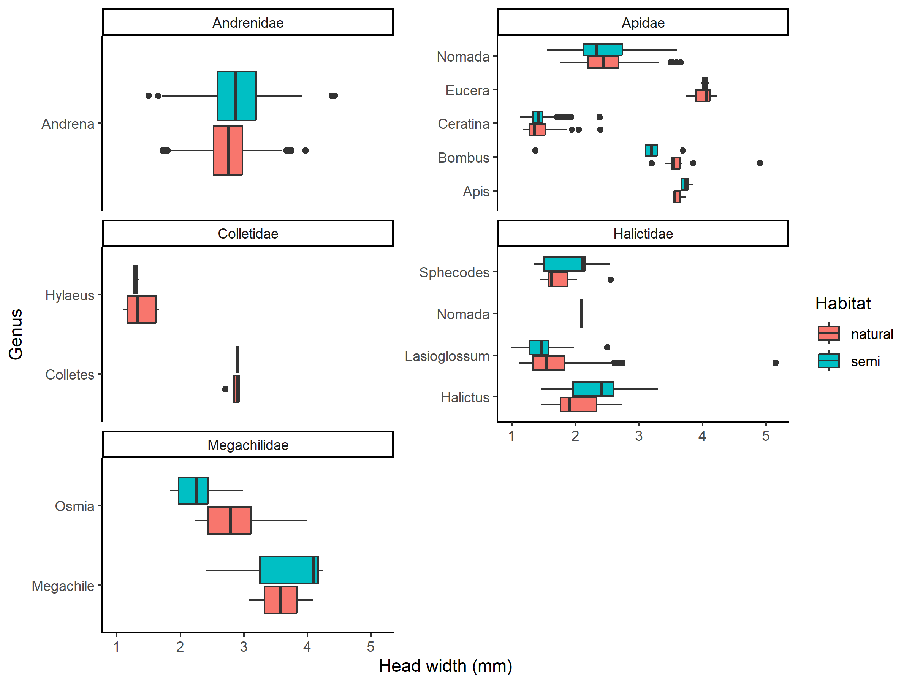
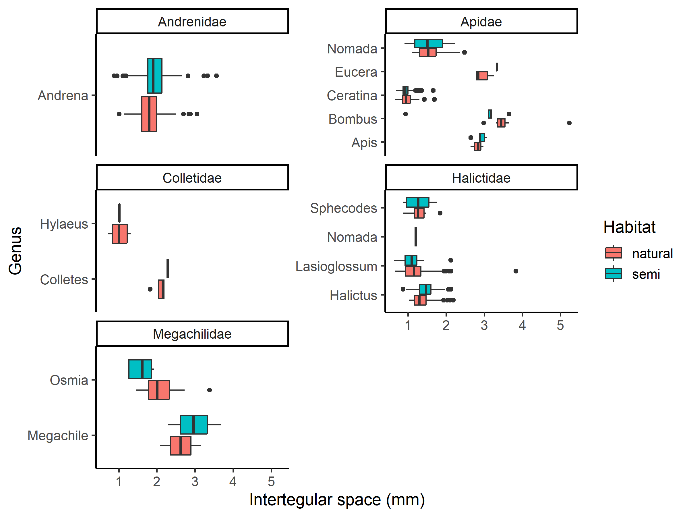
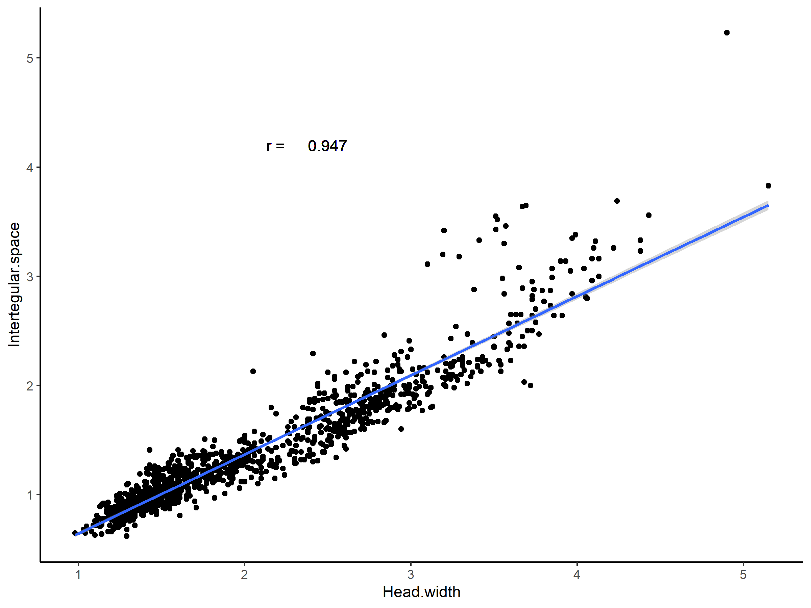
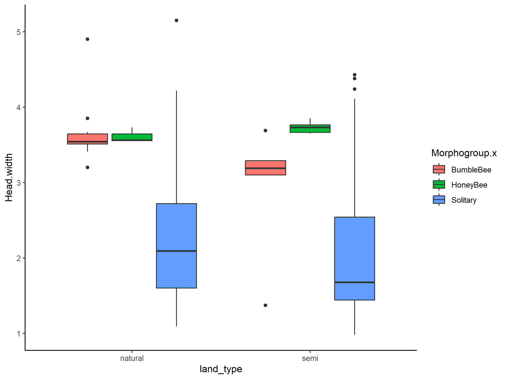
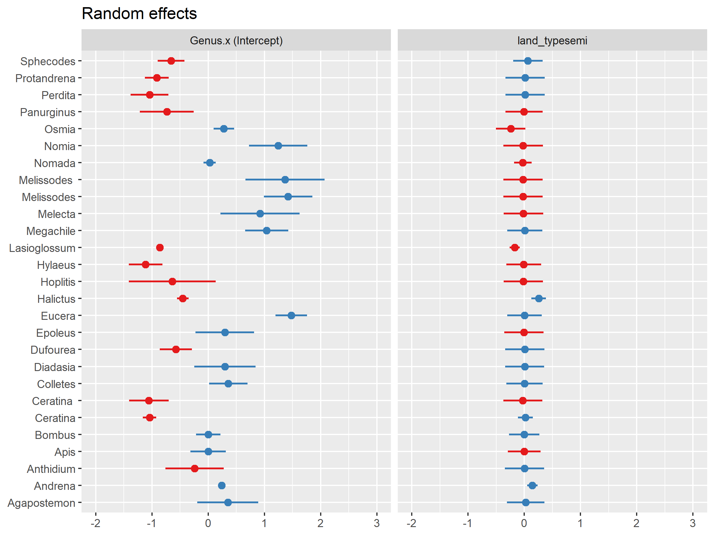
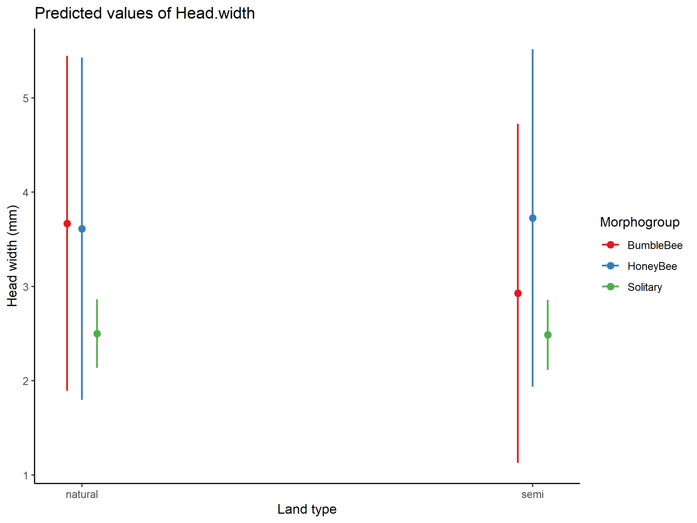
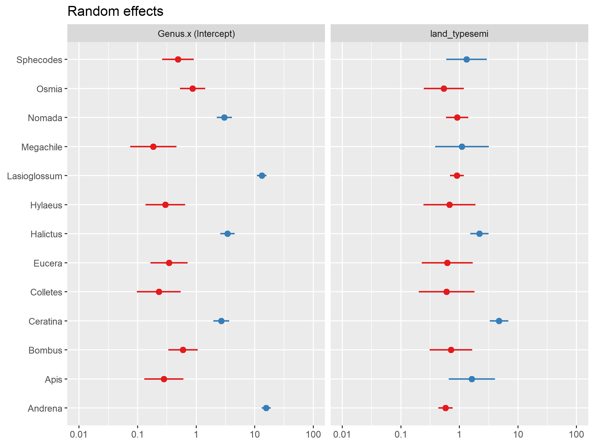

Canola Analysis
================
Dr. Riley M. Anderson & Salena Helmreich
October 27, 2023

  

- [Overview](#overview)
  - [Summary of Results](#summary-of-results)
- [Exploratory data analysis](#exploratory-data-analysis)
- [Models](#models)
- [Are some species more common in natural
  areas?](#are-some-species-more-common-in-natural-areas)
- [Session Information](#session-information)

## Overview

This analysis explores Salena’s canola experiment.

### Summary of Results

- Some bees have reduced head width in semi natural areas while others
  have increased head width in semi natural areas.

- Most bees have head widths that vary independently of land type.

## Exploratory data analysis

<!-- -->

<!-- -->

<!-- -->

<!-- -->

<!-- -->

## Models

    ## Linear mixed model fit by REML ['lmerMod']
    ## Formula: Head.width ~ land_type * Morphogroup.x + (land_type | Genus.x)
    ##    Data: bees1
    ## 
    ## REML criterion at convergence: 1311.2
    ## 
    ## Scaled residuals: 
    ##     Min      1Q  Median      3Q     Max 
    ## -3.9766 -0.4565 -0.0618  0.3848  8.9558 
    ## 
    ## Random effects:
    ##  Groups   Name          Variance Std.Dev. Corr 
    ##  Genus.x  (Intercept)   0.80400  0.8967        
    ##           land_typesemi 0.03202  0.1789   -0.08
    ##  Residual               0.15350  0.3918        
    ## Number of obs: 1238, groups:  Genus.x, 27
    ## 
    ## Fixed effects:
    ##                                     Estimate Std. Error t value
    ## (Intercept)                          3.67000    0.90518   4.054
    ## land_typesemi                       -0.74200    0.27941  -2.656
    ## Morphogroup.xHoneyBee               -0.05667    1.29403  -0.044
    ## Morphogroup.xSolitary               -1.16893    0.92395  -1.265
    ## land_typesemi:Morphogroup.xHoneyBee  0.85581    0.42800   2.000
    ## land_typesemi:Morphogroup.xSolitary  0.72855    0.28822   2.528
    ## 
    ## Correlation of Fixed Effects:
    ##             (Intr) lnd_ty Mrp.HB Mrph.S l_:M.H
    ## land_typesm -0.112                            
    ## Mrphgrp.xHB -0.700  0.078                     
    ## Mrphgrp.xSl -0.980  0.109  0.685              
    ## lnd_ty:M.HB  0.073 -0.653 -0.167 -0.071       
    ## lnd_typ:M.S  0.108 -0.969 -0.076 -0.112  0.633
    ## Analysis of Deviance Table (Type II Wald chisquare tests)
    ## 
    ## Response: Head.width
    ##                          Chisq Df Pr(>Chisq)  
    ## land_type               0.5554  1    0.45612  
    ## Morphogroup.x           2.5688  2    0.27681  
    ## land_type:Morphogroup.x 6.6563  2    0.03586 *
    ## ---
    ## Signif. codes:  0 '***' 0.001 '**' 0.01 '*' 0.05 '.' 0.1 ' ' 1

<!-- -->

The best model considers a normally distributed random intercept of
*Genus.x*. This essentially models the effect of *land_type* for each
genus as lines with separate intercepts in the equation, which makes
sense as variation in head width should vary to a greater degree across
genera than within genera. Additionally, we allow the slope (effect of
land type) to vary for each genus. However, the variance attributable to
the random slopes is relatively small (~0.032) compared to that
attributed to the intercept (~0.804) meaning the land type variable more
or less effects each genus equally. AIC supports the inclusion of the
random slope but I don’t think it is actually giving us any useful
information.

There are very small differences in head_width attributable to land type
but only for a few genera. For example, *Panurginus* and *Lasioglossum*
have smaller head width in semi natural areas but *Halictus* and
*Andrena* have larger head width in semi natural areas. *Panurginus* is
extremely rare in the data so I definitely wouldn’t rely on that one.
Overall, I wouldn’t place much weight on these findings as the variance
component is so small that the estimates are probably unreliable.

<!-- -->

The fixed-effects reveal a land_type by morphogroup interaction where
bumblebees have smaller head width in semi natural areas
( =
-0.742, t = -2.655614) while honeybees and solitary bees have similar
head width in both land types. This interaction is really just telling
us that *Bombus* has a different response to land type than all of the
other genera since it’s the only genus in morphogroup = bumblebee.

## Are some species more common in natural areas?

- WARNING This is not a proper occupancy model as we aren’t accounting
  for detection probabilities (uncertainty in detection efforts).

This is a quick glimpse at the odds of finding particular genera in semi
natural areas relative to natural areas.

Proper occupancy modeling can be done (with a significant amount of
work) if this is a question of interest.

    ## Generalized linear mixed model fit by maximum likelihood (Laplace
    ##   Approximation) [glmerMod]
    ##  Family: binomial  ( logit )
    ## Formula: cbind(occupied, unoccupied) ~ land_type + (land_type | Genus.x)
    ##    Data: genera
    ## 
    ##      AIC      BIC   logLik deviance df.resid 
    ##    223.0    229.3   -106.5    213.0       21 
    ## 
    ## Scaled residuals: 
    ##      Min       1Q   Median       3Q      Max 
    ## -0.74013 -0.38234  0.01713  0.16807  0.40908 
    ## 
    ## Random effects:
    ##  Groups  Name          Variance Std.Dev. Corr
    ##  Genus.x (Intercept)   2.3350   1.5281       
    ##          land_typesemi 0.5377   0.7333   0.08
    ## Number of obs: 26, groups:  Genus.x, 13
    ## 
    ## Fixed effects:
    ##               Estimate Std. Error z value Pr(>|z|)    
    ## (Intercept)    -3.4424     0.4348  -7.918 2.41e-15 ***
    ## land_typesemi  -0.1803     0.2537  -0.711    0.477    
    ## ---
    ## Signif. codes:  0 '***' 0.001 '**' 0.01 '*' 0.05 '.' 0.1 ' ' 1
    ## 
    ## Correlation of Fixed Effects:
    ##             (Intr)
    ## land_typesm -0.025

<!-- -->

Again, the variance component for the random slope is small but there
may be some trends for a few genera. For example, *Halictus* and
*Ceratina* are more likely to be found in semi natural areas, while
*Andrena* and *Osmia* are more likely to found in natural areas. Keep in
mind the simplified model structure here and its limitations. Also the
model is run on a reduced data set including only genera that were found
in both land types. With the full data set, there are more random effect
levels than observations making the random effect parameters
unidentifiable.

## Session Information

    R version 4.2.3 (2023-03-15 ucrt)
    Platform: x86_64-w64-mingw32/x64 (64-bit)
    Running under: Windows 10 x64 (build 19045)

    Matrix products: default

    locale:
    [1] LC_COLLATE=English_United States.utf8 
    [2] LC_CTYPE=English_United States.utf8   
    [3] LC_MONETARY=English_United States.utf8
    [4] LC_NUMERIC=C                          
    [5] LC_TIME=English_United States.utf8    

    attached base packages:
    [1] stats     graphics  grDevices utils     datasets  methods   base     

    other attached packages:
     [1] car_3.1-2       carData_3.0-5   sjPlot_2.8.13   lme4_1.1-32    
     [5] Matrix_1.6-1    glmmTMB_1.1.8   cowplot_1.1.1   lubridate_1.9.2
     [9] forcats_1.0.0   stringr_1.5.0   dplyr_1.1.1     purrr_1.0.1    
    [13] readr_2.1.4     tidyr_1.3.0     tibble_3.2.1    ggplot2_3.4.1  
    [17] tidyverse_2.0.0

    loaded via a namespace (and not attached):
     [1] splines_4.2.3       modelr_0.1.11       datawizard_0.7.0   
     [4] highr_0.10          yaml_2.3.7          bayestestR_0.13.0  
     [7] numDeriv_2016.8-1.1 pillar_1.9.0        backports_1.4.1    
    [10] lattice_0.20-45     glue_1.6.2          digest_0.6.31      
    [13] RColorBrewer_1.1-3  minqa_1.2.5         colorspace_2.1-0   
    [16] sandwich_3.0-2      htmltools_0.5.5     pkgconfig_2.0.3    
    [19] broom_1.0.4         haven_2.5.2         xtable_1.8-4       
    [22] mvtnorm_1.1-3       scales_1.2.1        tzdb_0.3.0         
    [25] timechange_0.2.0    emmeans_1.8.5       mgcv_1.8-42        
    [28] generics_0.1.3      farver_2.1.1        sjlabelled_1.2.0   
    [31] TH.data_1.1-2       withr_2.5.0         TMB_1.9.2          
    [34] cli_3.6.1           survival_3.5-3      magrittr_2.0.3     
    [37] estimability_1.4.1  evaluate_0.20       fansi_1.0.4        
    [40] nlme_3.1-162        MASS_7.3-58.2       tools_4.2.3        
    [43] hms_1.1.3           lifecycle_1.0.3     multcomp_1.4-23    
    [46] munsell_0.5.0       ggeffects_1.2.0     compiler_4.2.3     
    [49] rlang_1.1.0         grid_4.2.3          nloptr_2.0.3       
    [52] rstudioapi_0.14     labeling_0.4.2      rmarkdown_2.21     
    [55] boot_1.3-28.1       gtable_0.3.3        codetools_0.2-19   
    [58] abind_1.4-5         sjstats_0.18.2      sjmisc_2.8.9       
    [61] R6_2.5.1            zoo_1.8-12          knitr_1.42         
    [64] performance_0.10.2  fastmap_1.1.1       utf8_1.2.3         
    [67] rprojroot_2.0.3     insight_0.19.1      stringi_1.7.12     
    [70] Rcpp_1.0.10         vctrs_0.6.1         tidyselect_1.2.0   
    [73] xfun_0.38          
