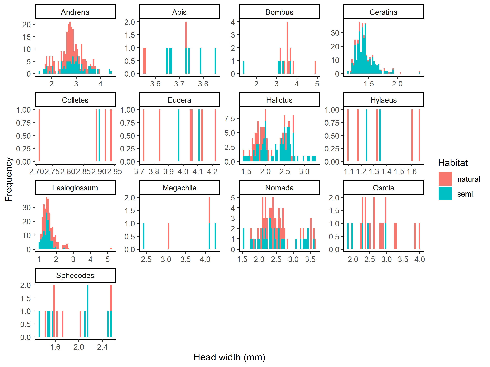
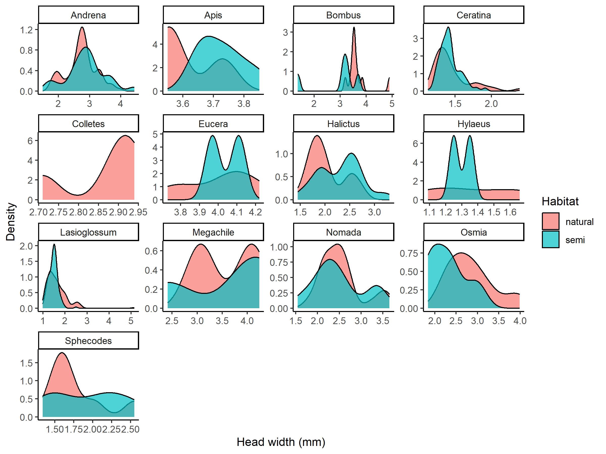
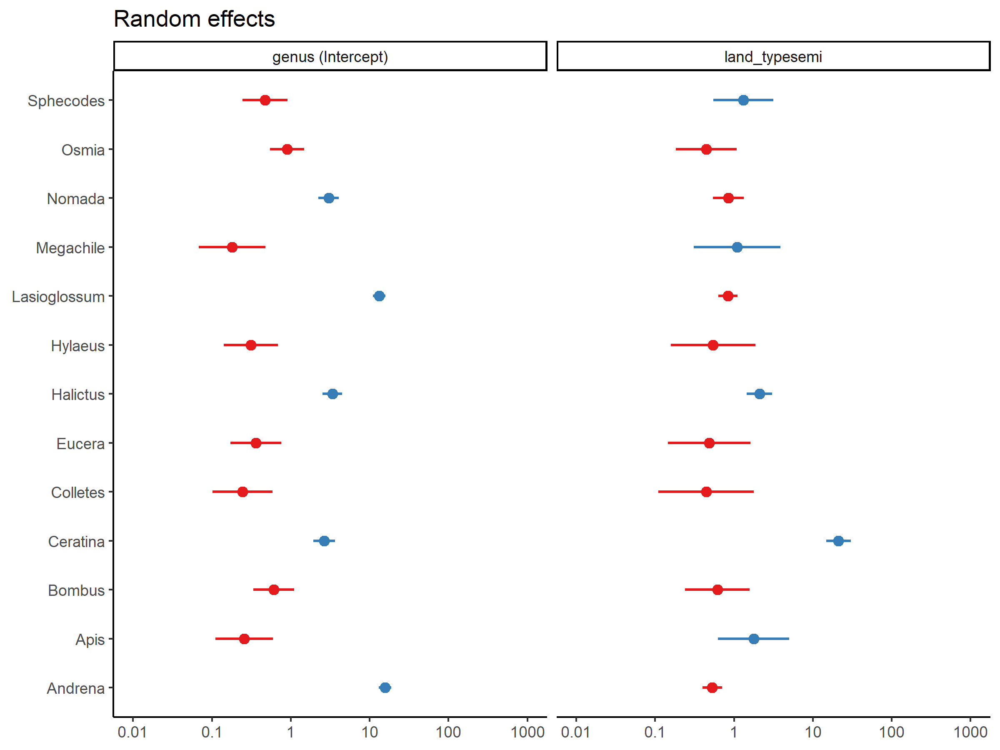

Canola Analysis
================
Dr. Riley M. Anderson & Salena Helmreich
October 19, 2024

  

- [Overview](#overview)
  - [Summary of Results](#summary-of-results)
- [Exploratory data analysis](#exploratory-data-analysis)
- [Models](#models)
  - [Head width ~ genus x habitat
    type](#head-width--genus-x-habitat-type)
  - [Head width ~ habitat type \* genus \*
    season](#head-width--habitat-type--genus--season)
- [Are some species more common in natural
  areas?](#are-some-species-more-common-in-natural-areas)
- [Session Information](#session-information)

## Overview

This analysis explores Salena’s canola experiment.

### Summary of Results

- Some bees have reduced head width in semi natural areas while others
  have increased head width in semi natural areas.

- Most bees have head widths that vary independently of land type.

## Exploratory data analysis

- Head width by genus, family, and land type
  <!-- -->

- Intertegular space by genus, family, and land type
  <!-- -->

- Correlation between head width and intertegular space
  <!-- -->

- Head width by morphogroup and land type
  <!-- -->

- Histogram of head width
  <!-- -->

- Density plot of head width
  <!-- -->

Only a few genera have useful replication: Andrena, Ceratina, Halictus,
Lasioglossum, Nomada, Osmia, and Sphecodes. Interestingly, Halictus
appears very bimodal, perhaps there are two distinct species that we
could separate.

## Models

### Head width ~ genus x habitat type

<!-- -->

**Figure XX. Bee head width by genus and habitat type.** Points are the
predicted values from a linear mixed model. Whiskers are 95% confidence
intervals. Asterisks indicate significant habitat type effects at: \*
*P* \< 0.1, \*\* *P* \< 0.05.

    ## Analysis of Deviance Table (Type II Wald chisquare tests)
    ## 
    ## Response: head_width
    ##                     Chisq Df Pr(>Chisq)    
    ## land_type          0.0657  1    0.79778    
    ## genus           1814.2247  6  < 2.2e-16 ***
    ## transect           8.3092  3    0.04003 *  
    ## period             3.3064  2    0.19143    
    ## land_type:genus   41.7037  6  2.104e-07 ***
    ## ---
    ## Signif. codes:  0 '***' 0.001 '**' 0.01 '*' 0.05 '.' 0.1 ' ' 1
    ## Linear mixed model fit by REML ['lmerMod']
    ## Formula: head_width ~ land_type * genus + transect + period + (1 | site)
    ##    Data: model_bees
    ## 
    ## REML criterion at convergence: 1145.9
    ## 
    ## Scaled residuals: 
    ##     Min      1Q  Median      3Q     Max 
    ## -3.3578 -0.4691 -0.0692  0.4014  8.7418 
    ## 
    ## Random effects:
    ##  Groups   Name        Variance Std.Dev.
    ##  site     (Intercept) 0.01725  0.1313  
    ##  Residual             0.14824  0.3850  
    ## Number of obs: 1143, groups:  site, 11
    ## 
    ## Fixed effects:
    ##                                 Estimate Std. Error t value
    ## (Intercept)                      2.65665    0.06257  42.461
    ## land_typesemi                    0.18810    0.10026   1.876
    ## genusCeratina                   -1.22730    0.07274 -16.871
    ## genusHalictus                   -0.60071    0.06815  -8.814
    ## genusLasioglossum               -1.03254    0.04525 -22.818
    ## genusNomada                     -0.15597    0.06967  -2.239
    ## genusOsmia                       0.19152    0.10796   1.774
    ## genusSphecodes                  -0.89858    0.15057  -5.968
    ## transect1                       -0.06710    0.02501  -2.682
    ## transect2                        0.02203    0.02329   0.946
    ## transect3                        0.04204    0.02182   1.927
    ## period1                          0.02036    0.01992   1.022
    ## period2                          0.02138    0.01981   1.079
    ## land_typesemi:genusCeratina     -0.23116    0.08838  -2.616
    ## land_typesemi:genusHalictus      0.06491    0.09140   0.710
    ## land_typesemi:genusLasioglossum -0.33031    0.07631  -4.329
    ## land_typesemi:genusNomada       -0.22597    0.10393  -2.174
    ## land_typesemi:genusOsmia        -0.76296    0.20797  -3.669
    ## land_typesemi:genusSphecodes    -0.03024    0.20283  -0.149

- Stats methods

To increase parity in our analysis, We restricted our records to include
only bee genera that occurred in both natural and semi-natural habitats
and had at least 3 records in each habitat type. Consistent with
previous studies (citations), bee head width and intertegular space were
highly correlated (*r* = 0.95, *P* \< 0.001, 2). Therefore, we
haphazardly opted to use head width exclusively in our analyses. Data
preprocessing was performed with the *tidyverse* ecosystem of packages
(Wickham et al. 2019).

To test the prediction that semi-natural habitats would reduce bee
health, we modeled bee head width (our proxy for bee health) as a
function of habitat type using a linear mixed model with the lme4
package (Bates et al. 2015). Fixed effects included habitat type, genus,
and their two-way interaction. We modeled the field collection site as a
normally distributed random intercept. To account for variation in field
collection transect, we opted to include this term as a fixed effect to
avoid unreliable variance estimates as there were only 4 levels. We used
an analysis of deviance to determine the contribution of each model term
to the reduction in model deviance using the CAR package (Fox and
Weisberg 2019). Simple slope post hoc tests were used to determine
interaction effect sizes at the individual genus level using the EMmeans
package (Lenth 2023). All analyses were conducted using R, version 4.2.3
(R Core Team 2023).

- Stats results

In total, we found 1238 bees representing 25 genera within 5 families.
Bee abundance was biased towards semi-natural sites with 686 bees found,
while natural sites had 552 bees. *you could add in something about the
different species that were found in only the natural or semi natural
sites*.

Sample size and habitat overlap exclusions restricted our dataset to
1143 observations from seven genera; Andrena, Ceratina, Halictus,
Lasioglossum, Nomada, Osmia, and Sphecodes. Overall, the habitat type
and bee genera interaction significantly reduced model deviance
(
= 41.7, *P* \< 0.001). Post hoc tests revealed disparate effects of
habitat type on head width for the various genera. Andrena and Halictus
showed decreased head width in natural sites, relative to semi-natural
habitats
(
= -0.19 *P* = 0.08;

= -0.25 *P* = 0.03). Osmia showed the opposite, with increased head
width in the natural habitat compared to the semi-natural habitat
(
= 0.57 *P* = 0.01). The head width of Ceratina, Lasioglossum, Nomada,
and Sphecodes all varied independently of habitat type (*P* \> 0.1)
(Figure XX).

- Citations

<!-- -->

    ## 
    ## To cite package 'tidyverse' in publications use:
    ## 
    ##   Wickham H, Averick M, Bryan J, Chang W, McGowan LD, François R,
    ##   Grolemund G, Hayes A, Henry L, Hester J, Kuhn M, Pedersen TL, Miller
    ##   E, Bache SM, Müller K, Ooms J, Robinson D, Seidel DP, Spinu V,
    ##   Takahashi K, Vaughan D, Wilke C, Woo K, Yutani H (2019). "Welcome to
    ##   the tidyverse." _Journal of Open Source Software_, *4*(43), 1686.
    ##   doi:10.21105/joss.01686 <https://doi.org/10.21105/joss.01686>.
    ## 
    ## A BibTeX entry for LaTeX users is
    ## 
    ##   @Article{,
    ##     title = {Welcome to the {tidyverse}},
    ##     author = {Hadley Wickham and Mara Averick and Jennifer Bryan and Winston Chang and Lucy D'Agostino McGowan and Romain François and Garrett Grolemund and Alex Hayes and Lionel Henry and Jim Hester and Max Kuhn and Thomas Lin Pedersen and Evan Miller and Stephan Milton Bache and Kirill Müller and Jeroen Ooms and David Robinson and Dana Paige Seidel and Vitalie Spinu and Kohske Takahashi and Davis Vaughan and Claus Wilke and Kara Woo and Hiroaki Yutani},
    ##     year = {2019},
    ##     journal = {Journal of Open Source Software},
    ##     volume = {4},
    ##     number = {43},
    ##     pages = {1686},
    ##     doi = {10.21105/joss.01686},
    ##   }
    ## 
    ## To cite package 'emmeans' in publications use:
    ## 
    ##   Lenth R (2024). _emmeans: Estimated Marginal Means, aka Least-Squares
    ##   Means_. R package version 1.10.2,
    ##   <https://CRAN.R-project.org/package=emmeans>.
    ## 
    ## A BibTeX entry for LaTeX users is
    ## 
    ##   @Manual{,
    ##     title = {emmeans: Estimated Marginal Means, aka Least-Squares Means},
    ##     author = {Russell V. Lenth},
    ##     year = {2024},
    ##     note = {R package version 1.10.2},
    ##     url = {https://CRAN.R-project.org/package=emmeans},
    ##   }
    ## 
    ## To cite lme4 in publications use:
    ## 
    ##   Douglas Bates, Martin Maechler, Ben Bolker, Steve Walker (2015).
    ##   Fitting Linear Mixed-Effects Models Using lme4. Journal of
    ##   Statistical Software, 67(1), 1-48. doi:10.18637/jss.v067.i01.
    ## 
    ## A BibTeX entry for LaTeX users is
    ## 
    ##   @Article{,
    ##     title = {Fitting Linear Mixed-Effects Models Using {lme4}},
    ##     author = {Douglas Bates and Martin M{\"a}chler and Ben Bolker and Steve Walker},
    ##     journal = {Journal of Statistical Software},
    ##     year = {2015},
    ##     volume = {67},
    ##     number = {1},
    ##     pages = {1--48},
    ##     doi = {10.18637/jss.v067.i01},
    ##   }
    ## 
    ## To cite the car package in publications use:
    ## 
    ##   Fox J, Weisberg S (2019). _An R Companion to Applied Regression_,
    ##   Third edition. Sage, Thousand Oaks CA.
    ##   <https://socialsciences.mcmaster.ca/jfox/Books/Companion/>.
    ## 
    ## A BibTeX entry for LaTeX users is
    ## 
    ##   @Book{,
    ##     title = {An {R} Companion to Applied Regression},
    ##     edition = {Third},
    ##     author = {John Fox and Sanford Weisberg},
    ##     year = {2019},
    ##     publisher = {Sage},
    ##     address = {Thousand Oaks {CA}},
    ##     url = {https://socialsciences.mcmaster.ca/jfox/Books/Companion/},
    ##   }
    ## 
    ## To cite R in publications use:
    ## 
    ##   R Core Team (2023). R: A language and environment for statistical
    ##   computing. R Foundation for Statistical Computing, Vienna, Austria.
    ##   URL https://www.R-project.org/.
    ## 
    ## A BibTeX entry for LaTeX users is
    ## 
    ##   @Manual{,
    ##     title = {R: A Language and Environment for Statistical Computing},
    ##     author = {{R Core Team}},
    ##     organization = {R Foundation for Statistical Computing},
    ##     address = {Vienna, Austria},
    ##     year = {2023},
    ##     url = {https://www.R-project.org/},
    ##   }
    ## 
    ## We have invested a lot of time and effort in creating R, please cite it
    ## when using it for data analysis. See also 'citation("pkgname")' for
    ## citing R packages.

### Head width ~ habitat type \* genus \* season

- Don’t include this in the chapter:

<!-- -->

    ## Analysis of Deviance Table (Type II Wald chisquare tests)
    ## 
    ## Response: head_width
    ##                            Chisq Df Pr(>Chisq)    
    ## genus                  1781.8899  4  < 2.2e-16 ***
    ## land_type                 0.0319  1    0.85814    
    ## period                    3.3109  2    0.19101    
    ## transect                  5.1708  3    0.15971    
    ## genus:land_type          42.3543  4  1.409e-08 ***
    ## genus:period             42.2503  8  1.215e-06 ***
    ## land_type:period          2.2777  2    0.32019    
    ## genus:land_type:period   17.6700  8    0.02384 *  
    ## ---
    ## Signif. codes:  0 '***' 0.001 '**' 0.01 '*' 0.05 '.' 0.1 ' ' 1
    ## Linear mixed model fit by REML ['lmerMod']
    ## Formula: head_width ~ genus * land_type * period + transect + (1 | site)
    ##    Data: filter(model_bees, genus != "Sphecodes" & genus != "Osmia")
    ## 
    ## REML criterion at convergence: 1070.3
    ## 
    ## Scaled residuals: 
    ##     Min      1Q  Median      3Q     Max 
    ## -3.5772 -0.4622 -0.0391  0.3618  8.4979 
    ## 
    ## Random effects:
    ##  Groups   Name        Variance Std.Dev.
    ##  site     (Intercept) 0.01818  0.1348  
    ##  Residual             0.14083  0.3753  
    ## Number of obs: 1107, groups:  site, 11
    ## 
    ## Fixed effects:
    ##                                         Estimate Std. Error t value
    ## (Intercept)                              2.71401    0.07559  35.906
    ## genusCeratina                           -1.20192    0.08823 -13.622
    ## genusHalictus                           -0.66011    0.09274  -7.118
    ## genusLasioglossum                       -0.87006    0.08303 -10.479
    ## genusNomada                             -0.10086    0.09170  -1.100
    ## land_typesemi                            0.16606    0.11375   1.460
    ## period2                                 -0.05416    0.06806  -0.796
    ## period3                                  0.17436    0.10173   1.714
    ## transect1                               -0.04321    0.02557  -1.690
    ## transect2                                0.02988    0.02366   1.263
    ## transect3                                0.03162    0.02239   1.412
    ## genusCeratina:land_typesemi             -0.30339    0.10751  -2.822
    ## genusHalictus:land_typesemi              0.03675    0.12898   0.285
    ## genusLasioglossum:land_typesemi         -0.33944    0.12156  -2.792
    ## genusNomada:land_typesemi               -0.26789    0.12579  -2.130
    ## genusCeratina:period2                   -0.03976    0.17471  -0.228
    ## genusHalictus:period2                    0.58596    0.17664   3.317
    ## genusLasioglossum:period2               -0.05952    0.10614  -0.561
    ## genusNomada:period2                     -0.10293    0.15062  -0.683
    ## genusCeratina:period3                   -0.26664    0.29815  -0.894
    ## genusHalictus:period3                   -0.34693    0.16496  -2.103
    ## genusLasioglossum:period3               -0.57002    0.13006  -4.383
    ## genusNomada:period3                     -0.38260    0.19803  -1.932
    ## land_typesemi:period2                    0.10525    0.11653   0.903
    ## land_typesemi:period3                   -0.16047    0.17686  -0.907
    ## genusCeratina:land_typesemi:period2      0.08400    0.21064   0.399
    ## genusHalictus:land_typesemi:period2     -0.63765    0.26519  -2.404
    ## genusLasioglossum:land_typesemi:period2 -0.23158    0.16777  -1.380
    ## genusNomada:land_typesemi:period2        0.14369    0.27001   0.532
    ## genusCeratina:land_typesemi:period3      0.43191    0.33776   1.279
    ## genusHalictus:land_typesemi:period3      0.43194    0.23742   1.819
    ## genusLasioglossum:land_typesemi:period3  0.22817    0.21687   1.052
    ## genusNomada:land_typesemi:period3       -0.12767    0.36744  -0.347

<!-- -->

    ## genus = Andrena, period = 1:
    ##  contrast       estimate    SE    df t.ratio p.value
    ##  natural - semi -0.16606 0.114  19.8  -1.456  0.1611
    ## 
    ## genus = Ceratina, period = 1:
    ##  contrast       estimate    SE    df t.ratio p.value
    ##  natural - semi  0.13733 0.118  22.2   1.160  0.2582
    ## 
    ## genus = Halictus, period = 1:
    ##  contrast       estimate    SE    df t.ratio p.value
    ##  natural - semi -0.20280 0.139  41.0  -1.460  0.1520
    ## 
    ## genus = Lasioglossum, period = 1:
    ##  contrast       estimate    SE    df t.ratio p.value
    ##  natural - semi  0.17338 0.133  35.9   1.303  0.2007
    ## 
    ## genus = Nomada, period = 1:
    ##  contrast       estimate    SE    df t.ratio p.value
    ##  natural - semi  0.10183 0.135  37.4   0.752  0.4569
    ## 
    ## genus = Andrena, period = 2:
    ##  contrast       estimate    SE    df t.ratio p.value
    ##  natural - semi -0.27131 0.127  29.8  -2.143  0.0405
    ## 
    ## genus = Ceratina, period = 2:
    ##  contrast       estimate    SE    df t.ratio p.value
    ##  natural - semi -0.05192 0.182 114.3  -0.285  0.7759
    ## 
    ## genus = Halictus, period = 2:
    ##  contrast       estimate    SE    df t.ratio p.value
    ##  natural - semi  0.32959 0.228 265.4   1.447  0.1490
    ## 
    ## genus = Lasioglossum, period = 2:
    ##  contrast       estimate    SE    df t.ratio p.value
    ##  natural - semi  0.29971 0.119  23.0   2.509  0.0196
    ## 
    ## genus = Nomada, period = 2:
    ##  contrast       estimate    SE    df t.ratio p.value
    ##  natural - semi -0.14711 0.239 295.0  -0.614  0.5395
    ## 
    ## genus = Andrena, period = 3:
    ##  contrast       estimate    SE    df t.ratio p.value
    ##  natural - semi -0.00558 0.182 122.9  -0.031  0.9756
    ## 
    ## genus = Ceratina, period = 3:
    ##  contrast       estimate    SE    df t.ratio p.value
    ##  natural - semi -0.13410 0.289 480.1  -0.463  0.6433
    ## 
    ## genus = Halictus, period = 3:
    ##  contrast       estimate    SE    df t.ratio p.value
    ##  natural - semi -0.47427 0.144  46.4  -3.295  0.0019
    ## 
    ## genus = Lasioglossum, period = 3:
    ##  contrast       estimate    SE    df t.ratio p.value
    ##  natural - semi  0.10568 0.121  25.4   0.873  0.3910
    ## 
    ## genus = Nomada, period = 3:
    ##  contrast       estimate    SE    df t.ratio p.value
    ##  natural - semi  0.38997 0.320 634.2   1.219  0.2235
    ## 
    ## Results are averaged over the levels of: transect 
    ## Degrees-of-freedom method: kenward-roger

## Are some species more common in natural areas?

- Don’t include this in your chapter.

- WARNING This is not a proper occupancy model as we aren’t accounting
  for detection probabilities (uncertainty in detection efforts).

This is a quick glimpse at the odds of finding particular genera in semi
natural areas relative to natural areas.

Proper occupancy modeling can be done (with a significant amount of
work) if this is a question of interest.

    ## Generalized linear mixed model fit by maximum likelihood (Laplace
    ##   Approximation) [glmerMod]
    ##  Family: binomial  ( logit )
    ## Formula: cbind(occupied, unoccupied) ~ land_type + (land_type | genus)
    ##    Data: genera
    ## 
    ##      AIC      BIC   logLik deviance df.resid 
    ##    231.6    237.9   -110.8    221.6       21 
    ## 
    ## Scaled residuals: 
    ##      Min       1Q   Median       3Q      Max 
    ## -0.58102 -0.25427 -0.01471  0.10537  0.21972 
    ## 
    ## Random effects:
    ##  Groups Name          Variance Std.Dev. Corr
    ##  genus  (Intercept)   2.344    1.531        
    ##         land_typesemi 1.265    1.125    0.12
    ## Number of obs: 26, groups:  genus, 13
    ## 
    ## Fixed effects:
    ##               Estimate Std. Error z value Pr(>|z|)    
    ## (Intercept)    -3.4428     0.4356  -7.903 2.73e-15 ***
    ## land_typesemi  -0.1020     0.3484  -0.293     0.77    
    ## ---
    ## Signif. codes:  0 '***' 0.001 '**' 0.01 '*' 0.05 '.' 0.1 ' ' 1
    ## 
    ## Correlation of Fixed Effects:
    ##             (Intr)
    ## land_typesm 0.043

<!-- -->

Again, the variance component for the random slope is small but there
may be some trends for a few genera. For example, *Halictus* and
*Ceratina* are more likely to be found in semi natural areas, while
*Andrena* and *Osmia* are more likely to be found in natural areas. Keep
in mind the simplified model structure here and its limitations. Also
the model is run on a reduced data set including only genera that were
found in both land types. With the full data set, there are more random
effect levels than observations making the random effect parameters
unidentifiable.

## Session Information

    R version 4.2.3 (2023-03-15 ucrt)
    Platform: x86_64-w64-mingw32/x64 (64-bit)
    Running under: Windows 10 x64 (build 19045)

    Matrix products: default

    locale:
    [1] LC_COLLATE=English_United States.utf8 
    [2] LC_CTYPE=English_United States.utf8   
    [3] LC_MONETARY=English_United States.utf8
    [4] LC_NUMERIC=C                          
    [5] LC_TIME=English_United States.utf8    

    attached base packages:
    [1] stats     graphics  grDevices utils     datasets  methods   base     

    other attached packages:
     [1] car_3.1-2       carData_3.0-5   sjPlot_2.8.13   lme4_1.1-32    
     [5] Matrix_1.6-1    glmmTMB_1.1.8   cowplot_1.1.1   lubridate_1.9.2
     [9] forcats_1.0.0   stringr_1.5.0   dplyr_1.1.1     purrr_1.0.1    
    [13] readr_2.1.4     tidyr_1.3.0     tibble_3.2.1    ggplot2_3.4.1  
    [17] tidyverse_2.0.0

    loaded via a namespace (and not attached):
     [1] splines_4.2.3       modelr_0.1.11       datawizard_0.7.0   
     [4] highr_0.10          yaml_2.3.7          bayestestR_0.13.0  
     [7] numDeriv_2016.8-1.1 pillar_1.9.0        backports_1.4.1    
    [10] lattice_0.20-45     glue_1.6.2          digest_0.6.31      
    [13] RColorBrewer_1.1-3  minqa_1.2.5         colorspace_2.1-0   
    [16] sandwich_3.0-2      htmltools_0.5.5     pkgconfig_2.0.3    
    [19] broom_1.0.4         haven_2.5.2         xtable_1.8-4       
    [22] mvtnorm_1.1-3       scales_1.2.1        tzdb_0.3.0         
    [25] timechange_0.2.0    emmeans_1.8.5       mgcv_1.8-42        
    [28] generics_0.1.3      farver_2.1.1        sjlabelled_1.2.0   
    [31] TH.data_1.1-2       withr_2.5.0         TMB_1.9.2          
    [34] cli_3.6.1           survival_3.5-3      magrittr_2.0.3     
    [37] estimability_1.4.1  evaluate_0.20       fansi_1.0.4        
    [40] nlme_3.1-162        MASS_7.3-58.2       tools_4.2.3        
    [43] hms_1.1.3           lifecycle_1.0.3     multcomp_1.4-23    
    [46] munsell_0.5.0       ggeffects_1.2.0     compiler_4.2.3     
    [49] rlang_1.1.0         grid_4.2.3          nloptr_2.0.3       
    [52] rstudioapi_0.14     labeling_0.4.2      rmarkdown_2.21     
    [55] boot_1.3-28.1       gtable_0.3.3        codetools_0.2-19   
    [58] abind_1.4-5         sjstats_0.18.2      sjmisc_2.8.9       
    [61] R6_2.5.1            zoo_1.8-12          knitr_1.42         
    [64] performance_0.10.2  fastmap_1.1.1       utf8_1.2.3         
    [67] rprojroot_2.0.3     insight_0.19.1      stringi_1.7.12     
    [70] Rcpp_1.0.10         vctrs_0.6.1         tidyselect_1.2.0   
    [73] xfun_0.38          
